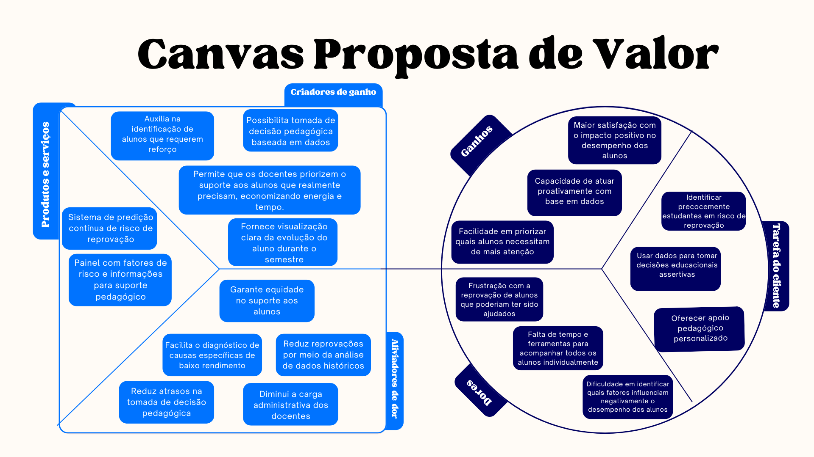
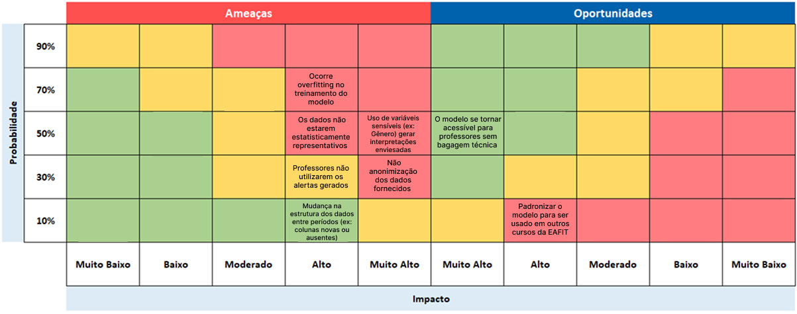
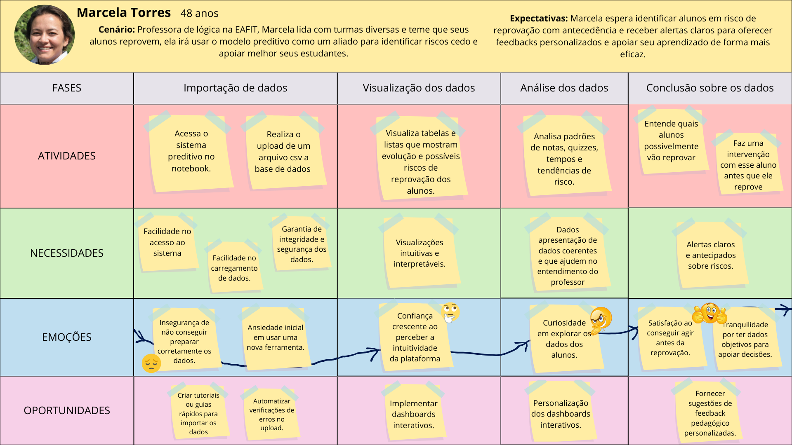

# Documentação Modelo Preditivo - Inteli

## EAFITure

### Los Hermanos

####

- <a href="https://www.linkedin.com/in/brenofgsilva/">Breno Silva</a>

- <a href="https://www.linkedin.com/in/gabriel-bartmanovicz/">Gabriel Bartmanovicz</a>

- <a href="https://www.linkedin.com/in/henrique-rodrigues-diniz-b7b011319/">Henrique Diniz</a>

- <a href="https://www.linkedin.com/in/isabela-pe%C3%A7anha-27b91a356/?originalSubdomain=br">Isabela Pecanha</a>

- <a href="https://www.linkedin.com/in/lucas-pomin/">Lucas Pomin</a>

- <a href="https://www.linkedin.com/in/mariana-pereira-394280346/">Mariana Pereira</a>

- <a href="https://www.linkedin.com/in/paulo-vitor-barros-de-almeida/">Paulo Vitor</a>

## Sumário

[1. Introdução](#c1)

[2. Objetivos e Justificativa](#c2)

[3. Metodologia](#c3)

[4. Desenvolvimento e Resultados](#c4)

[5. Conclusões e Recomendações](#c5)

[6. Referências](#c6)

[Anexos](#attachments)

## <a name="c1"></a>1. Introdução

&nbsp;&nbsp;&nbsp;&nbsp;A EAFIT é uma universidade privada localizada na capital da Colômbia, que oferece cursos de graduação e pós-graduação em diversas áreas e atualmente atende a mais de 9.100 alunos. Como uma instituição de ensino superior renomada, tem como objetivo oferecer apoio, educação e formação de qualidade ao maior número possível de estudantes, promovendo o desenvolvimento de habilidades e competências e auxiliando na empregabilidade. Para isso, adota como metodologia a parceria com organizações reais para a resolução de problemas práticos.

&nbsp;&nbsp;&nbsp;&nbsp;Tendo em vista o perceptível comprometimento da universidade com seus alunos, surge como preocupação para a instituição um acompanhamento mais próximo aos alunos no que tange ao seu desempenho acadêmico e a probabilidade de reprovação. A dificuldade em analisar profundamente cada situação acadêmica impede que os docentes ajam de forma efetiva nos casos mais críticos, o que dificulta a redução do número de discentes que não atingem a nota mínima para aprovação.

&nbsp;&nbsp;&nbsp;&nbsp;Com esse contexto, percebe-se a falta de uma ferramenta para apoiar os docentes no suporte aos alunos em situação de risco de reprovação. Além disso, a universidade carece de meios para minimizar a taxa de reprovação dos discentes da EAFIT e permitir que os docentes atuem de maneira embasada para intervir no caso de alunos com altas chances de reprovar.

## <a name="c2"></a>2. Objetivos e Justificativa

### 2.1 Objetivos

A Universidad EAFIT busca identificar de forma proativa quais de seus estudantes estão em risco de reprovação ao longo do semestre. O objetivo dessa iniciativa é oferecer um acompanhamento preventivo, permitindo que a instituição emita um aviso prévio aos alunos que apresentam sinais de dificuldade acadêmica. Com isso, pretende-se estimular ações que possam evitar a reprovação a tempo. Dessa maneira, a universidade contribui para o desenvolvimento integral dos alunos, ajudando-os a superar obstáculos e alcançar seu potencial máximo.

### 2.2 Proposta de solução

A solução proposta consiste no desenvolvimento de um modelo preditivo de classificação binária (aprovado/reprovado) baseado em machine learning, denominado EAFITure, que utiliza algoritmos supervisionados, como regressão logística, para analisar dados acadêmicos cronológicos, incluindo notas parciais, quizzes, tempos de resolução e outras variáveis. Essa abordagem resolve o problema ao identificar riscos de reprovação de forma antecipada e dinâmica, permitindo intervenções personalizadas e reforço de conteúdo, assim atendendo aos objetivos da EAFIT ao promover suporte preventivo e otimizar o acompanhamento docente. Além disso, a solução inclui um frontend intuitivo que facilita o uso da ferramenta pelos professores, com alertas visuais e dashboards interativos para uma tomada de decisões ágil.

### 2.3 Justificativa

A proposta se justifica pela capacidade de converter dados acadêmicos existentes em insights, otimizando o trabalho dos docentes ao permitir alertas precoces e eficientes, sem sobrecarga desses. Seus benefícios vão além da redução de reprovações, abrangendo o aumento da satisfação de professores e alunos por meio de intervenções personalizadas, além da otimização de recursos institucionais e tempo dos professores. Ela se diferencia de ferramentas genéricas de análise acadêmica por sua abordagem iterativa, explicável e personalizada, assim fomentando uma educação mais proativa. Seus potenciais incluem escalabilidade para outros cursos e integração com sistemas educacionais, ampliando o impacto no aprendizado dos alunos da EAFIT.

## 3. Metodologia

&nbsp;&nbsp;&nbsp;&nbsp;A metodologia adotada para este projeto é a **CRISP-DM (Cross Industry Standard Process for Data Mining)**, considerada um padrão de referência em projetos de ciência de dados. Seu objetivo central é fornecer uma estrutura clara e iterativa para transformar dados em conhecimento aplicável, apoiando a construção de modelos preditivos e a tomada de decisões informadas (Chapman et al., 2000; Roberto, 2023).  

&nbsp;&nbsp;&nbsp;&nbsp;O processo é composto por seis etapas, interconectadas e passíveis de revisitação, garantindo flexibilidade e refinamento contínuo. As fases são descritas a seguir.

&nbsp;&nbsp;&nbsp;&nbsp;**Entendimento do Negócio:** Nesta etapa, busca-se compreender o contexto institucional e definir os objetivos do projeto em termos claros e alinhados às necessidades estratégicas da organização parceira. É aqui que se estabelecem os critérios de sucesso e os indicadores que guiarão as análises, traduzindo demandas institucionais em metas analíticas. Uma definição incorreta ou incompleta nessa fase pode comprometer o desenvolvimento de todo o projeto.

&nbsp;&nbsp;&nbsp;&nbsp;**Entendimento dos dados:** Com os objetivos definidos, inicia-se a análise preliminar das informações disponíveis. Essa fase abrange a identificação das fontes, a descrição das variáveis, a verificação de consistência e a avaliação inicial da qualidade dos dados. Também são levantadas hipóteses sobre as relações possíveis entre os dados e o problema estudado. O propósito é construir uma base de entendimento sólida que orientará as etapas posteriores.

&nbsp;&nbsp;&nbsp;&nbsp;**Preparação dos Dados:** Trata-se de uma das etapas mais críticas do processo, pois garante que os dados estejam adequados para a modelagem. Envolve limpeza de inconsistências, tratamento de valores ausentes e outliers, transformação de variáveis, padronização de formatos e seleção de atributos mais relevantes. Frequentemente é a fase mais demorada e revisitada, visto que ajustes adicionais podem se tornar necessários à medida que a modelagem avança.

&nbsp;&nbsp;&nbsp;&nbsp;**Modelagem:** Nessa etapa, são definidos os algoritmos e técnicas estatísticas ou de aprendizado de máquina a serem utilizados. A modelagem compreende o treinamento de modelos com os dados preparados, explorando diferentes abordagens e parâmetros. Embora seja considerada uma das fases mais esperadas, sua eficácia depende diretamente da qualidade das fases de entendimento e preparação.

&nbsp;&nbsp;&nbsp;&nbsp;**Avaliação:** Com os modelos treinados, procede-se à análise de seus resultados em relação aos objetivos estabelecidos inicialmente. Avalia-se se o desempenho obtido atende às expectativas e critérios definidos, verificando métricas relevantes e validando a adequação do modelo ao problema. Quando necessário, a equipe pode retornar às etapas anteriores para refinar dados ou técnicas, buscando resultados mais consistentes.


&nbsp;&nbsp;&nbsp;&nbsp;**Implementação (Deploy):** Na etapa final, o modelo é colocado em prática, de modo a gerar valor para o contexto institucional. Essa implementação pode assumir diferentes formatos, como relatórios técnicos, dashboards interativos ou integração em sistemas digitais. Além disso, a fase contempla o planejamento de manutenção e monitoramento, assegurando a continuidade da utilidade do modelo ao longo do tempo.

&nbsp;&nbsp;&nbsp;&nbsp;A principal vantagem da CRISP-DM está em seu caráter **iterativo e flexível**, que permite ajustes constantes e retornos a fases anteriores quando necessário. Essa característica garante que o modelo desenvolvido não apenas atenda às exigências técnicas, mas também se mantenha coerente com os objetivos estratégicos da organização, assegurando maior consistência e aplicabilidade dos resultados.


## <a name="c4"></a>4. Desenvolvimento e Resultados

### 4.1. Compreensão do Problema

#### 4.1.1. Contexto da indústria

**Modelo de Negócio da EAFIT**<br>  
&nbsp;&nbsp;&nbsp;&nbsp;A EAFIT é uma instituição de ensino superior colombiana privada que oferece cursos de graduação e pós-graduação, com foco em inovação acadêmica, conexão com o setor empresarial e estímulo a experiência práticas antes da conclusão do curso. Seu público alvo consiste de estudantes que buscam empregabilidade e oportunidades de desenvolvimento profissional. A proposta de valor da instituição se baseia na junção do ensino, infraestrutura moderna, programas de intercâmbio e convivências no mercado de trabalho, fortalecendo a reputação da marca. As receitas são geradas essencialmente por mensalidades e serviços educacionais, enquanto cooperações estratégicas com empresas e investimentos em tecnologia expandem a capacidade de trazer diferencias competitivos.

**Tendências do Setor**<br>
&nbsp;&nbsp;&nbsp;&nbsp;O setor de ensino superior na Colômbia, assim como em outros países da América Latina, tem sido influenciado por modas globais e adaptações às demandas do mercado. Observa-se um crescimento na adoção de modelos híbridos de ensino, impulsionados pelo avanço da tecnologia nos últimos anos e pela necessiade de flexibilidade para diferentes tipos de estudantes. A digitalização dos processos acadêmicos, incluindo o uso de ferramentas de análise de dados está se tornando um diferencial competitivo. Além disso, cresce a relevância de parcerias entre instituições de ensino e empresas, que permitem alinhar a formação acadêmica às expectativas do mercado de trabalho. Essas tendências indicam que as universidades modernas que investirem em tecnologia, personalização da vivencia acadêmica e integração de experiências reais, terão um maior potencial de destaque.

### Cinco Forças de Porter

&nbsp;&nbsp;&nbsp;&nbsp;De acordo com Michael Porter (1986, apud PORTER, 2008), para que se torne possível examinar o ambiente em que uma empresa está inclusa, é necessário analisar sua performance no mercado em relação aos competidores, fatores internos e externos. Logo, o modelo das Cinco Forças de Porter é parte essencial da pesquisa de campo para tirar o maior proveito das oportunidades que irão se apresentar. O modelo tem como respectivas forças: rivalidade entre concorrentes; poder de barganha dos fornecedores; poder de barganha dos clientes; ameaça de novos entrantes; ameaça de produtos substitutos.

<div align="center">Figura 1 - Cinco Forças de Porter</div>


<sup>Fonte: Material produzido pelos autores (2025)</sup>

**Rivalidade entre concorrentes**:<br>
&nbsp;&nbsp;&nbsp;&nbsp;O setor de ensino superior na Colômbia é competitivo, composto por instituições privadas e públicas, que buscam formar estudantes de alta conduta por meio de bolsas, destaques acadêmicos, qualidade do corpo docente, programas de intercâmbio e empregabilidade de ex-alunos. A EAFIT possui um diferencial em inovação e ligação direta com o setor empresarial, que incentiva estudantes a terem experiências no mundo real antes da graduação, o que ajuda a destacar a sua marca. Entretanto, a contínua pressão competitiva demanda aprimoramento nos meios de auxílio ao estudante. O modelo preditivo de risco de reprovação irá funcionar como uma vantagem estratégica, tendo como foco reduzir taxas de evasão e aumentar a retenção, melhorando indicadores de desempenho institucional e reputação da instituição.  
&nbsp;&nbsp;&nbsp;&nbsp;Instituições como a _Universidad Pontificia Bolivariana, Universidad de Medellín_ e a _Universidad CES_ são exemplos de competidores relevantes no ambiente acadêmico colombiano. Essas universidades, assim como a EAFIT, buscam atrair e reter os estudantes por meio de programas acadêmicos de alta qualidade, infraestrutura de ponta e conexões estratégicas como o mercado de trabalho. A Universidad Pontificia Bolivariana se destaca pela tradição e forte identidade institucional, mantendo-se como uma ampla oferta de cursos e programas de pós-graduação. A Universidad de Medellín é reconhecida por seu engajamento com a inovação pedagógica e pela inserção dos alunos em projetos aplicados à realidade local. Já a Universidad CES, tem seu foco virado para áreas como saúde e ciências aplicadas, com investimentos expressivos em tecnologia e pesquisa. Essa diversidade de estratégias competitivas exigue que a EAFIT mantenha e expanda suas vantagens competitivas para poder continuar relevante no mercado.

**Poder de barganha dos fornecedores**:<br>  
&nbsp;&nbsp;&nbsp;&nbsp;A EAFIT não conta com **sistemas internos ou externos** para a análise de desempenho do corpo estudantil, a ferramenta seria uma ajuda excepcional para professores e membros acadêmicos que buscam auxiliar os estudantes a não desistirem e concluir um curso com devido esforço. Ao investir em sistemas preditivos de desempenho acadêmico, a EAFIT pode otimizar os atuais recursos pedagógicos, direcionando suporte acadêmico de forma mais eficiente e justificando investimentos em capacitação docente com base em dados concretos.

**Poder de barganha dos clientes**:<br>  
&nbsp;&nbsp;&nbsp;&nbsp;Estudantes e responsáveis têm alto poder de escolha entre universidades, especialmente nas grandes cidades colombianas. Critérios como valor das mensalidades, qualidade do ensino, empregabilidade e a flexibilidade (ensino híbrido ou remoto) influenciam a decisão. A implementação de um novo sistema que antecipe riscos de reprovação pode ser proposta como valor agregado, demonstrando que a universidade não apenas oferece ensino, mas acompanha proativamente a performance dos alunos, fortalecendo a satisfação e a fidelidade — fatores críticos para reduzir transferências e desistências.

**Ameaça de novos entrantes**:<br>  
&nbsp;&nbsp;&nbsp;&nbsp;Por mais que seja capaz criar uma universidade do zero, estabelecer uma instituição de ensino que seja capaz de competir ao mesmo nível, ou até mesmo superior em relação à outras faculdades já existentes, demanda um alto investimento em infraestrutura, certificações e reputação, logo, a ameaça de novos entrantes no mercado educacional é baixa. Para se manter competitiva, a EAFIT precisa reforçar seu diferencial em qualidade e acompanhamento personalizado. O modelo preditivo é um mecanismo para diferenciar-se de novos entrantes, mostrando capacidade tecnológica e cuidado individualizado com a jornada acadêmica.

**Ameaça de produtos substitutos**:<br>  
&nbsp;&nbsp;&nbsp;&nbsp;Modelos preditivos não são nenhuma novidade quando o assunto é analisar riscos, porém, não se apresenta nenhuma ferramenta consolidada virada para o risco de reprovação dentro do setor acadêmico. Atualmente, tanto a EAFIT como outras universidades, contam com a mão de obra de professores e corpo docente para formular registros semestrais dos alunos, de maneira manual, sem poder intervir em momentos antecipados para poder propor devido auxílio. Logo, ao oferecer suporte acadêmico particular e ações planejadas baseadas em análises preditivas, uma oportunidade estratégica é apresentada para a EAFIT, aumentando seu valor frente aos concorrentes.

&nbsp;&nbsp;&nbsp;&nbsp;Sendo assim, a aplicação do modelo das Cinco Forças de Porter demonstra um ambiente de alta competitividade no setor de ensino superiror colombiano, onde a EAFIT, apesar de já se destacar dos concorrentes, pode continuar ampliando sua vantagem competitiva por meio da implementação de um novo modelo preditivo de risco de reprovação. A ausência de ferramentas consolidadas dentro desse ambiente específico, em união com a possibilidade de otimizar recursos pedagógicos, aumentar a retenção de alunos e fortalecer a relação com o corpo estudantil, cria um contexto favorável para que a instituição continue se mantendo relevante no mercado.

#### 4.1.2. Análise SWOT

&nbsp;&nbsp;&nbsp;&nbsp; Segundo Kevin Dunne, a análise SWOT (Strengths, Weaknesses, Opportunities e Threats) é uma ferramenta estratégica utilizada para avaliar a situação atual de uma organização, identificando seus pontos fortes e fracos, assim como as oportunidades e ameaças do ambiente externo. Essa análise possibilita a construção de estratégias mais eficazes, alinhadas aos objetivos da instituição, e contribui para aumentar as chances de sucesso dos projetos.

&nbsp;&nbsp;&nbsp;&nbsp;A aplicação da análise SWOT permite compreender de forma ampla o cenário em que a organização está inserida, nesse caso a faculdade EAFIT, fornecendo embasamento para decisões mais assertivas. Ao explorar as forças, corrigir as fraquezas, aproveitar as oportunidades e se preparar para as ameaças, é possível garantir um direcionamento mais consistente no andamento do projeto.

<div align="center">Figura 2 - Análise SWOT</div>


<sup>Fonte: Material produzido pelos autores (2025)</sup>

**Forças**:<br>

- **Reputação e foco em projetos que conectam tecnologia a problemas reais:**<br>
  A EAFIT é reconhecida por colocar o estudante para resolver dores concretas de empresas e da sociedade com um enfoque em tecnologia. O resultado é um perfil de egresso mão na massa, pronto para entregar valor desde o primeiro dia.

- **Inserida no polo “Valle del Software”:**<br>
  Estar em Medellín, ecossistema apelidado de “Valle del Software”, coloca a universidade em um ponto estratégico de crescimento. Essa proximidade facilita estágios e projetos de P&D.

- **Presença consistente em rankings globais:**<br>
  A aparição recorrente da faculdade em rankings internacionais dá visibilidade externa e reforça sua qualidade. Além de ajudar na captação de talentos e docentes, abre portas para convênios, intercâmbios e pesquisa conjunta com universidades de outros países.

**Fraquezas:**<br>

- **Aluno/docente relativamente elevado (~20.2 alunos para cada docente):**<br>
  Turmas mais cheias reduzem a atenção individual que cada aluno recebe. Isso pressiona correções, feedbacks e tutoria, afetando o acompanhamento de quem precisa de reforço e a personalização do processo de aprendizagem.

- **Pressão competitiva reputacional:**<br>
  No cenário colombiano e regional, há instituições com marcas muito fortes disputando os mesmos alunos, professores e parcerias. Manter-se relevante exige comunicar diferenciais com clareza e atualizar programas com velocidade, especialmente nas áreas de tecnologia e negócios.

- **Poucos alunos internacionais:**<br>
  A falta de alunos internacionais é um empecilho para o crescimento internacional da faculdade, já que diminui suas possibilidades de reconhecimento por mais faculdades em outros lugares do mundo.

**Oportunidades:**<br>

- **Alianças acadêmicas e empresariais:**<br>
  Parcerias como G8 (com EIA, CES, etc.) para fundos de bolsas e com corporações criam oportunidades para acesso inclusivo. Eventos como Conexión Summit e alianças internacionais expandem redes.

- **Aproveitar a IA para melhorar serviços e acompanhamento:**<br>
  Ferramentas de IA podem antecipar risco acadêmico, personalizar trilhas de estudo, agilizar atendimento e apoiar decisões acadêmicas e administrativas. Além de melhorar a experiência do aluno, gera dados valiosos para aprimorar currículos e gestão.

- **Investimentos em inovação e startups:**<br>
  O ecossistema de empreendedorismo em Medellín (Ruta N) oferece oportunidades para o centro On.going da EAFIT, que apoia startups. Com o PIB per capita em ascensão, há maior poder de compra para educação privada de qualidade, beneficiando programas como Economia.

**Ameaças:**<br>

- **Queda na demanda por educação superior e excesso de oferta:**<br>
  Mudanças demográficas e maior concorrência podem reduzir o número de candidatos e aumentar vagas ociosas. Isso pressiona finanças e exige diferenciação clara para manter turmas cheias.

- **Déficit de corpo docente qualificado:**<br>
  Encontrar e reter professores com prática de mercado e produção científica relevante é um desafio — especialmente em áreas quentes como tecnologia. A escassez eleva custos e pode limitar a atualização dos cursos.

- **Ambiente competitivo por relevância e investimento:**<br>
  Universidades de ponta e grandes EdTechs disputam atenção, financiamento e parcerias. Quem não acelera inovação curricular, pesquisa aplicada e inserção internacional corre o risco de perder protagonismo no médio prazo.

A onda de IA crescente reforça a importância do nosso projeto, pois ele conversa profundamente com os pontos da análise. Ataca fraquezas como a alta razão aluno/docente e a baixa presença internacional, já que um sistema eficiente de acompanhamento pode melhorar resultados e ser um diferencial atrativo para fora do país. Responde à ameaça da queda na demanda e excesso de oferta, aumentando taxas de aprovação e reduzindo evasão. Aproveita oportunidades como o uso de IA para personalizar apoio e fortalecer alianças acadêmicas e empresariais, mostrando inovação prática. Ao gerar dados estratégicos e resultados concretos, o projeto ajuda a manter turmas cheias, sustenta a qualidade acadêmica e potencializa a reputação da universidade no cenário local e internacional.

#### 4.1.3. Planejamento Geral da Solução

##### a) Dados disponíveis

&nbsp;&nbsp;&nbsp;&nbsp;Os dados disponíveis foram fornecidos pela Universidad EAFIT, na forma de dois documentos Excel contendo informações sobre o desempenho acadêmico de estudantes matriculados no mesmo curso durante dois períodos acadêmicos diferentes (2023-1 e 2023-2). O conteúdo inclui variáveis como: calificaciones parciales (Parcial_1, Parcial_2), resultados de quices (Quiz1, Quiz2, Quiz3, Quiz4), tempos de resolução dos quices (TiempoQ1, TiempoQ2, TiempoQ3, TiempoQ4), notas em projetos e talleres, características demográficas (gênero, idade, indicação de curso STEM), dificuldades estimadas dos eventos avaliativos e o resultado final de aprovação/reprovação (Aprobó/Reprobó). Esses dados são cronológicos, permitindo simulações de predições em momentos específicos do semestre, e foram anonimizados para preservar a privacidade.

##### b) Solução proposta

&nbsp;&nbsp;&nbsp;&nbsp;A solução proposta é o desenvolvimento de um modelo preditivo supervisionado de classificação binária (Aprobó/Reprobó), denominado EAFITure, que utiliza técnicas de machine learning para identificar estudantes em risco de reprovação de forma antecipada e contínua. O modelo será treinado com os dados históricos disponíveis, considerando a evolução cronológica das avaliações (como quices e parciais), e atualizará as predições após cada evento avaliativo importante. Isso vai além de um simples cálculo de média, incorporando interações entre variáveis, dificuldades dos temas e perfis dos alunos para prever não apenas o resultado final, mas também o desempenho em avaliações futuras.

##### c) Como a solução proposta deverá ser utilizada

&nbsp;&nbsp;&nbsp;&nbsp;A solução será integrada a um sistema ou painel acessível aos docentes, onde as predições serão geradas à medida que novos dados de avaliações são inseridos (por exemplo, após um quiz ou parcial). Os docentes receberão alertas automáticos indicando alunos em risco, com detalhes sobre os motivos (como dificuldades em temas específicos ou aumento no tempo de resolução), gráficos de evolução e recomendações de intervenções (ex.: tutorías ou retroalimentação personalizada). O uso será iterativo ao longo do semestre, permitindo atualizações dinâmicas, e deve ser adotado em momentos chave para priorizar o acompanhamento, sem substituir o julgamento humano, mas complementando-o.

##### d) Benefícios trazidos pela solução proposta

&nbsp;&nbsp;&nbsp;&nbsp;A solução facilita decisões informadas e oportunas para os docentes, permitindo intervenções precoces que melhoram os resultados acadêmicos, reduzem a taxa de reprovação e a evasão estudantil, e aumentam a satisfação tanto de professores quanto de alunos. Para a EAFIT, otimiza recursos ao focar esforços em casos críticos, promove equidade no suporte pedagógico e gera dados estratégicos para aprimorar currículos.

##### e) Critério de sucesso

O sucesso será medido por métricas quantitativas, como recall acima de 80% na identificação de alunos em risco (priorizando a detecção precoce para minimizar falsos negativos), precisão geral superior a 85% e redução observada na taxa de reprovação em testes simulados entre semestres. Qualitativamente, será avaliado pela adoção pelos docentes, feedback positivo sobre a utilidade das predições e impacto mensurável em indicadores institucionais.

#### 4.1.4. Value Proposition Canvas

&nbsp;&nbsp;&nbsp;&nbsp;Segundo Osterwalder et al. (2014), o Canvas de Proposta de Valor é uma ferramenta estratégica que permite aos empreendedores desenhar, testar, visualizar e aprimorar produtos e serviços, baseando-se na compreensão das necessidades, desejos e desafios dos clientes. Essa abordagem consiste em transmitir uma mensagem clara sobre o que a empresa oferece, como se diferencia dos concorrentes e de que forma entrega benefícios relevantes e percebidos como valiosos pelo público-alvo (STRATEGYZER, 2025).

&nbsp;&nbsp;&nbsp;&nbsp;A estrutura do Canvas Proposta de Valor é composta por duas partes: um círculo, que representa o perfil do cliente, e um quadrado, que simboliza o mapa de valor do produto. Essas partes são divididas em três áreas:

- **Tarefas do cliente**: No perfil do cliente, são identificadas as tarefas que ele precisa realizar. O produto deve auxiliar na execução dessas tarefas para gerar valor.
- **Dores**: São os problemas enfrentados pelo cliente. O produto deve reduzir ou eliminar essas dores.
- **Ganhos**: Benefícios esperados pelo cliente. O produto deve entregá-los de maneira eficaz.

<div align="center">
Figura 3 - Canvas Proposta de Valor

<sup>Fonte: Material produzido pelos autores (2025)</sup>
</div>

##### Aplicação do Canvas ao Projeto

&nbsp;&nbsp;&nbsp;&nbsp;O Canvas Proposta de Valor é aplicável ao projeto da Universidad EAFIT por fornecer uma estrutura prática para alinhar o desenvolvimento do modelo preditivo às reais necessidades dos docentes e da instituição. A partir da identificação das tarefas do cliente, como detectar precocemente estudantes em risco de reprovação e intervir de forma eficaz, o Canvas ajuda a direcionar o projeto para entregar valor mensurável. As dores mapeadas, como a dificuldade de acompanhar todos os alunos em tempo real e a frustração com reprovações evitáveis, são diretamente abordadas com funcionalidades baseadas em dados acadêmicos como notas parciais, resultados de quizzes, desempenho em projetos e tempo de resolução de avaliações. Já os ganhos esperados, como decisões pedagógicas mais informadas, melhora na taxa de aprovação e maior engajamento dos docentes, orientam o desenho da solução. Dessa forma, o projeto deixa de ser apenas técnico e passa a ser estratégico, promovendo intervenções educativas oportunas e resultados concretos no desempenho estudantil.

##### Tarefas do cliente

O cliente (EAFIT) busca:

- Identificar precocemente estudantes em risco de reprovação.
- Usar dados para tomar decisões educacionais assertivas.
- Oferecer apoio pedagógico personalizado.
- Atuar proativamente com base em dados educacionais.
- Melhorar a satisfação com o desempenho dos alunos.
- Priorizar quais alunos necessitam de mais atenção.

##### Dores

- Frustração com a reprovação de alunos que poderiam ter sido ajudados.
- Falta de tempo e ferramentas para acompanhar individualmente todos os alunos.
- Dificuldade em identificar fatores que influenciam negativamente o desempenho acadêmico.

##### Ganhos

- Capacidade de atuação proativa com base em dados.
- Facilidade para priorizar o suporte a alunos que precisam de mais atenção.
- Redução de reprovações evitáveis.
- Satisfação com o impacto positivo no desempenho dos estudantes.

### Mapa de Valor do Produto

#### Produtos e serviços

- Sistema de predição contínua de risco de reprovação.
- Painel com fatores de risco e recomendações de intervenção.
- Visualização clara da evolução dos alunos ao longo do semestre.

#### Criadores de ganho

- Permite que docentes priorizem alunos que realmente precisam de suporte.
- Auxilia na identificação de matérias que requerem reforço.
- Possibilita decisões pedagógicas baseadas em dados.
- Aumenta a eficiência e o engajamento docente.

#### Aliviadores de dor

- Evita reprovações com base em dados históricos.
- Garante equidade no suporte aos alunos.
- Reduz atrasos na tomada de decisões pedagógicas.
- Diminui a carga administrativa dos docentes.
- Facilita o diagnóstico de causas específicas de baixo rendimento.

&nbsp;&nbsp;&nbsp;&nbsp;Desse modo, com a aplicação do Canvas Proposta de Valor, é possível mapear com clareza os desafios e objetivos dos stakeholders envolvidos no contexto educacional. O projeto se propõe a entregar valor por meio da antecipação de riscos de reprovação e da personalização do suporte pedagógico, garantindo uma gestão mais inteligente e orientada por dados. Assim, tanto os alunos quanto os docentes são beneficiados, promovendo melhores resultados educacionais e maior eficiência no uso dos recursos disponíveis.

#### 4.1.5. Matriz de Riscos

&nbsp;&nbsp;&nbsp;&nbsp;Segundo Soares, Catapan e Meza (2019), a matriz de risco é um instrumento de planejamento das ações e auxílio à gestão dos recursos financeiros de uma instituição para prevenir, minimizar ou eliminar os riscos envolvidos nos processos administrativos, permitindo uma avaliação qualitativa ou quantitativa da probabilidade e do impacto de eventos adversos. Essa ferramenta é essencial no gerenciamento de projetos, pois relaciona a probabilidade de ocorrência de riscos com seu potencial impacto, facilitando a priorização e o desenvolvimento de estratégias de mitigação. Além disso, a matriz pode ser estendida para incluir oportunidades, identificando eventos positivos que, com baixa probabilidade ou esforço, podem gerar alto impacto benéfico no projeto. Um aspecto chave é sua natureza iterativa, exigindo revisões periódicas para ajustar avaliações à medida que o projeto avança e novas informações surgem.

&nbsp;&nbsp;&nbsp;&nbsp;No contexto do projeto EAFITure, aplicamos o conceito de matriz de riscos e oportunidades para mapear ameaças potenciais que poderiam comprometer o desenvolvimento do modelo preditivo de identificação de estudantes em risco de reprovação, bem como oportunidades para maximizar o valor entregue à Universidad EAFIT. A matriz foi elaborada considerando cortes cronológicos do projeto, como as sprints definidas no planejamento Scrum, e priorizando riscos que poderiam afetar a generalização entre semestres (2023-1 e 2023-2) ou a interpretabilidade dos dados. Da mesma forma, oportunidades foram mapeadas para explorar expansões, como a previsão de desempenho em avaliações futuras e a padronização para outros cursos.

&nbsp;&nbsp;&nbsp;&nbsp;A matriz de riscos e oportunidades elaborada para o projeto é ilustrada na figura anexada, onde as ameaças são posicionadas à esquerda (com impacto de "Muito Baixo" a "Muito Alto") e as oportunidades à direita (com impacto de "Muito Alto" a "Muito Baixo"), cruzadas com probabilidades de 10% a 90%. Em relação aos riscos identificados, temos:

- Não anonimização dos dados fornecidos: Com probabilidade moderada (30%) e impacto alto, esse risco viola a confidencialidade e pode expor dados sensíveis de estudantes, como gênero ou idade, levando a questões éticas ou legais. O plano de ação inclui a aplicação imediata de técnicas de anonimização no Google Colab, como pseudonimização ou remoção de identificadores, antes de qualquer processamento.
- Mudança na estrutura dos dados entre períodos (ex: colunas novas/ausentes): Probabilidade baixa (10%) e impacto baixo, mas poderia afetar a validação cronológica (treino em 2023-1, teste em 2023-2), causando vazamento temporal ou inconsistências nas features como notas de quizzes ou tempos (TiempoQ). Como mitigação, implementaremos checagens automáticas de schema nos notebooks Colab e ajustes manuais baseados no cronograma do curso.
- Os dados não estarem estatisticamente representativos: Com probabilidade de 50% e impacto moderado, isso poderia comprometer a generalização do modelo, especialmente com variáveis de perfil (STEM, Programa) ou dificuldades estimadas no cronograma, levando a baixas métricas como Recall para "Reprobó". O plano envolve análise exploratória inicial (EDA) para detectar desbalanceamentos e aplicação de técnicas como oversampling ou feature engineering contextual.
- Professores não utilizam alertas gerados: Probabilidade alta (70%) e impacto moderado, uma vez que o sistema visa ativar intervenções docentes, mas docentes sem bagagem técnica (mapeado na jornada do usuário na Sprint 1) poderiam ignorá-los. Para mitigar, incluiremos explicações interpretáveis (SHAP em RF05) e treinamentos simulados nos relatórios gerados.
- Ocorre uma overfitting no treinamento do modelo: Probabilidade alta (70%) e impacto alto, comum em modelos de classificação binária com features como tempos de quizzes ou notas parciais, resultando em baixa performance em dados novos (2023-2). Ações incluem validação cruzada temporal, regularização (ex: via scikit-learn no Colab) e monitoramento de métricas como ROC AUC e F1-score.

<div align="center">
 <sub>Figura 4 - Matriz de Riscos e Oportunidades Sprint 1</sub>



<sup>Fonte: Material produzido pelos autores (2025)</sup>

</div>

Em relação às oportunidades identificadas, temos:

- O modelo se tornar acessível para professores sem bagagem técnica: Com alta probabilidade (50%) e impacto alto, isso alinha com o objetivo de gerar relatórios simples e atualizações dinâmicas, sem deploy externo. Pode ser explorado via interfaces amigáveis no Colab, como dashboards interativos, para responder perguntas-chave como "este estudante vai aprovar?".
- Padronizar o uso em cursos de EAFIT: Probabilidade moderada (30%) e impacto muito alto, permitindo expansão além do curso introdutório, usando o cronograma como feature contextual. Isso poderia ser realizado integrando o modelo a outros datasets semelhantes, com baixo esforço adicional após a validação inicial.

&nbsp;&nbsp;&nbsp;&nbsp;Dessa forma, percebe-se que a matriz de riscos e oportunidades é uma ferramenta valiosa para o gerenciamento ágil do projeto EAFITure, destacando a necessidade de foco em dados de qualidade e interpretabilidade para mitigar ameaças principais, como overfitting e não adoção. As soluções propostas, como anonimização proativa e validações temporais, garantem alinhamento com os requisitos, enquanto as oportunidades enfatizam o potencial de impacto positivo, como acessibilidade e escalabilidade, contribuindo para intervenções oportunas e melhoria nas taxas de aprovação na Universidad EAFIT. Revisões iterativas na matriz durante as sprints assegurarão adaptações contínuas.

#### 4.1.6. Personas

&nbsp;&nbsp;&nbsp;&nbsp;Segundo Louise Bruton (2022), personas no contexto de UI/UX, são representações fictícias de usuários reais, criadas com base em pesquisas qualitativas e quantitativas para auxiliar designers a compreenderem melhor o público-alvo e tomarem decisões de design mais informadas. Essas personas incluem detalhes demográficos, comportamentais, motivações, dores e objetivos, promovendo empatia e garantindo que o produto priorize as necessidades dos usuários, o que resulta em experiências mais intuitivas e eficazes.

&nbsp;&nbsp;&nbsp;&nbsp;Tendo em vista esses pontos, em nosso projeto nós criamos duas personas: uma sendo uma professora e outra sendo um aluno, ambos pertencentes a EAFIT. Fizemos isso para auxiliar o desenvolvimento do projeto e não perdermos de vista os nossos objetivos.
Persona Professora (usa o modelo):

<p align = "center"> Figura 5: Persona 1: Professora</p>

<p align="center">  </p>
<p align = 'center'>Imagem feita pelos autores (2025).</p> <br><br>

informações da persona:

- Nome: Marcela Torres
- Idade: 48 anos
- Cidadania: Bogotá, Colombia
- Profissão: Professora de Lógica de Programação na Universidad EAFIT
- Educação e Formação: Ensino Superior completo, formado em Ciência da Computação
- Estado Civil: Casada
- Hobby: Culinária
- Biografia: Marcela Torres é uma educadora apaixonada por tecnologia e ensino. Com mais de 20 anos de experiência na área de computação, ela dedica sua carreira ao ensino da lógica de programação, buscando constantemente novas formas de tornar conceitos complexos acessíveis a seus alunos. Fora da sala de aula, Marcela encontra na culinária uma forma de relaxar e se expressar criativamente. Ela é conhecida por levar seus doces estrangeiros para eventos da universidade. Mora com o marido e gosta de passar os fins de semana testando receitas novas.
- Necessidades/Expectativas: Quero que a nova ferramenta de predição consiga me avisar com antecedência a reprovação ou não dos meus alunos, dessa forma conseguirei ajuda-los em sua formação e a realizarem seus sonhos de vida, através de uma boa educação na universidade.
- Motivação: Marcela, apesar de ser uma professora rígida, não gosta de ter que reprovar seus alunos, principalmente por entender que sua disciplina faz parte do ciclo básico de todos os cursos, logo o perfil de seus alunos é heterogêneo e nem todos são da área de exatas. Devido a isso ela gostaria de conseguir ajudar seus alunos, especialmente os com risco de reprovação, com feedbacks individuais e mais específicos.
- Dores/Frustrações: Não conseguir ajudar meus alunos devido a falta de ferramentas personalizadas que permitam acompanhar o desempenho individual de cada aluno com mais precisão é uma das coisas que mais me incomodam. Embora me esforce para oferecer uma formação de qualidade, sinto que as plataformas e recursos disponíveis atualmente não oferecem suporte suficiente para diagnosticar dificuldades específicas ou fornecer feedbacks realmente direcionados. Por lecionar uma disciplina obrigatória para diversos cursos, frequentemente recebo estudantes de áreas muito distintas, muitos dos quais não possuem familiaridade com lógica ou sequer têm base sólida em matemática. Isso gera uma grande disparidade na sala de aula, tornando mais difícil avançar no ritmo ideal sem deixar parte da turma para trás. Essa combinação de fatores contribui para uma sensação de impotência, especialmente quando identifico alunos com potencial, mas que estão prestes a serem reprovados por não conseguirem acompanhar o conteúdo.

Persona Aluno (afetado pelo modelo):

<p align = "center"> Figura 6: Persona 2: Aluno</p>

<p align="center">  </p>
<p align = 'center'>Imagem feita pelos autores (2025).</p> <br><br>

informações da persona:

- Nome: Esteban Ramírez
- Idade: 19 anos
- Cidadania: Medellín, Colômbia
- Profissão: Estudante
- Educação e Formação: Ensino Superior incompleto, cursando Psicologia na Universidad EAFIT
- Estado Civil: Solteiro
- Hobby: Leitura
- Biografia: Esteban é um jovem curioso e introspectivo, apaixonado por compreender o comportamento humano. Está no primeiro semestre do curso de Psicologia na Universidad EAFIT e, apesar de ainda estar descobrindo as possibilidades da profissão, já demonstra grande interesse por áreas como neuropsicologia e saúde mental. Gosta de passar seu tempo livre lendo livros de ficção e psicologia. Embora tenha facilidade com leitura e interpretação de texto, sente dificuldades em disciplinas obrigatórias da grade, especialmente aquelas ligadas à matemática, que julga estar “fora de sua zona de conforto”.
- Necessidades/Expectativas: Tenho a expectativa de que aos professores usarem a nova ferramenta e suas predições forem assertivas eu receba um acompanhamento prévio e assim as chances de melhorar minhas notas aumentem.
- Motivação: Por mais que pareça trivial, essa é uma matéria pertencente ao ciclo básico e sem ela eu não poderei continuar meu curso, o que me impediria de realizar meu sonho de me formar em uma faculdade e exercer a profissão que quero.
- Dores/Frustrações: Devido a me sentir fora da zona de conforto durante as aulas da disciplina de Lógica de Programação eu me sinto inseguro para realizar minhas atividades e avaliações e isso faz com que meu desempenho caia e esteja correndo risco de reprovação, isso me deixa extremamente descontente, pois sei que sou capaz porém preciso de uma orientação, mais específica para mim, desta forma conseguirei melhorar minhas notas e alcançar meus objetivos mais rapidamente.

#### 4.1.7. Jornadas do Usuário

&nbsp;&nbsp;&nbsp;&nbsp;  O mapeamento da jornada do usuário é uma das ferramentas mais relevantes em User Experience (UX), pois permite compreender não apenas os fluxos de interação, mas também as necessidades emocionais e práticas de quem utiliza determinada solução. De acordo com o UserBit (2025), “Um user journey map é uma visualização que capta o processo pelo qual uma pessoa passa para alcançar um objetivo do início ao fim e ajuda profissionais de UX a identificar rapidamente etapas onde os usuários se sentem satisfeitos ou frustrados, gerando oportunidades de design para aprimorar sua experiência” (UserBit – Journey Maps UX Terms
)

&nbsp;&nbsp;&nbsp;&nbsp;Com base nesse conceito, foi construída a jornada da persona Marcela Torres, docente da EAFIT, que enfrenta o desafio de identificar alunos em risco de reprovação de forma precoce e assertiva. O template adotado foi estruturado em quatro fases principais — importação de dados, visualização, análise e conclusão —, cada uma delas contemplando atividades, necessidades, emoções e oportunidades. Essa abordagem garante que não apenas o percurso funcional seja descrito, mas também que sejam revelados os pontos de dor e os momentos de satisfação da usuária.

<div align="center">

<sub>Figura 7 – Persona Marcela</sub>  


<sup>Fonte: Material produzido pelos autores (2025)</sup>  <br/>
<sup>A jornada de usuário também pode ser acessado pelo link: https://www.canva.com/design/DAGwofmhQas/1D8kxi9kj5Jmz1cO2I24XA/edit?utm_content=DAGwofmhQas&utm_campaign=designshare&utm_medium=link2&utm_source=sharebutton</sup>

</div>
&nbsp;&nbsp;&nbsp;&nbsp;Na primeira fase, importação dos dados, Marcela experimenta sentimentos de insegurança e ansiedade diante da possibilidade de não preparar corretamente o arquivo ou enfrentar falhas na nova ferramenta. Isso evidencia a necessidade de acessibilidade simplificada e segurança na integridade dos dados, além de abrir espaço para oportunidades como a criação de tutoriais interativos e a automação de verificações de erros.

&nbsp;&nbsp;&nbsp;&nbsp;Na fase seguinte, de visualização dos dados, a docente passa a ter contato direto com representações gráficas e tabelas, o que desperta confiança crescente ao perceber a intuitividade da plataforma. Aqui se destacam as necessidades de clareza e interpretabilidade das visualizações, abrindo espaço para melhorias como a implementação de dashboards interativos, capazes de ampliar a autonomia da professora e tornar a exploração de dados mais fluida.
  
&nbsp;&nbsp;&nbsp;&nbsp;Já no estágio de análise dos dados, Marcela demonstra curiosidade em explorar padrões, tendências e riscos associados ao desempenho dos alunos. Essa fase reforça a importância de fornecer dados consistentes e coerentes que auxiliem no raciocínio pedagógico, assim como ferramentas de personalização dos dashboards, que podem atender à diversidade de estilos de ensino e diferentes perfis de turmas.

&nbsp;&nbsp;&nbsp;&nbsp;Por fim, a fase de conclusão sobre os dados representa o ponto de maior impacto na experiência da persona. Ao obter satisfação e tranquilidade por conseguir agir de forma preventiva, Marcela encontra valor real na solução, pois o sistema lhe possibilita intervir antes da reprovação efetiva. Nesse estágio, as oportunidades de design giram em torno da oferta de alertas claros e antecipados e de sugestões pedagógicas personalizadas, que podem fortalecer a confiança docente e garantir maior efetividade no processo.

&nbsp;&nbsp;&nbsp;&nbsp;A partir da elaboração da Jornada de Usuário, foi possível ter a empatia com a persona Marcela, refletindo as expectativas de docentes que se beneficiariam do sistema. Com isso, obtiveram-se insights valiosos sobre tarefas, necessidades, emoções e oportunidades em toda a trajetória de uso do modelo preditivo, orientando melhorias no design e na funcionalidade da solução.


#### 4.1.8 Política de Privacidade

&nbsp;&nbsp;&nbsp;&nbsp;A política de privacidade consiste em um documento que busca esclarecer o modo como uma organização coleta, utiliza, armazena e protege os dados de seus clientes e colaboradores. No contexto colombiano, atende às disposições da Lei nº 1581 de 2012 e demais normativas aplicáveis, que estabelecem diretrizes claras sobre o tratamento de dados pessoais e garantem o pleno exercício dos direitos dos titulares. Já no Brasil, aplica-se principalmente a Lei Geral de Proteção de Dados Pessoais (Lei nº 13.709/2018), que define princípios, obrigações e direitos relacionados ao tratamento de dados, disciplinando práticas de coleta, armazenamento, uso e compartilhamento. Essa legislação visa assegurar transparência, segurança e respeito à privacidade, especialmente em situações em que o titular das informações não possui total ciência ou controle sobre a utilização de seus dados.

##### Informações Gerais

&nbsp;&nbsp;&nbsp;&nbsp;Esta política de privacidade informa como o projeto EAFITure, desenvolvido pelo grupo Los Hermanos em parceria com a Universidade EAFIT, trata os dados pessoais coletados durante o uso da solução. O projeto está em conformidade com a Lei Estatutária 1581 de 2012 e o Decreto Regulamentar 1377 de 2013 da Colômbia, bem como com a Lei Geral de Proteção de Dados Pessoais (Lei nº 13.709/2018) do Brasil.

##### Dados Coletados

&nbsp;&nbsp;&nbsp;&nbsp;Os dados coletados para o treinamento do modelo preditivo referem-se principalmente a características acadêmicas dos alunos da disciplina de Pensamento Computqcional, bem como algumas propriedades pessoais. De maneira específica, a base de dados contém as seguintes informações:

- Tipo de documento;
- Nome do curso matriculado;
- Indicação se o aluno é menor ou maior de idade;
- Indicação se o curso pertence à área STEM (Ciências, Tecnologia, Engenharia e Matemática);
- Gênero;
- Notas obtidas nas provas parciais;
- Notas obtidas nos projetos realizados durante o semestre;
- Notas finais das oficinas. Notas dos quizzes;
- Tempo gasto na realização de quizzes;
- Média das notas dos quizzes;
- Indicação se houve melhora nas notas dos quizzes;
- Magnitude da melhora nas notas dos quizzes;
- Resultado final de aprovação ou reprovação no curso.

##### Finalidade do Tratamento

&nbsp;&nbsp;&nbsp;&nbsp;O propósito do tratamento dos dados é alimentar um modelo preditivo que estime notas e identifique estudantes com risco de reprovação, e, assim, forneça informações necessárias, como perfil do aluno e matérias que geram dificuldade, para que os docentes da universidade possam intervir de maneira assertiva em casos de risco.

##### Armazenamento e Retenção

&nbsp;&nbsp;&nbsp;&nbsp;O armazenamento dos dados será realizado pela **UNIVERSIDADE EAFIT**, na condição de **Responsável pelo Tratamento** dos dados pessoais. A infraestrutura e o local de hospedagem serão definidos pela Universidade, que adotará as medidas necessárias para a segurança da informação, seguindo as normas e políticas internas da instituição. Ademais, durante o período de desenvolvimento do projeto EAFITure, a equipe Los Hermanos, composta por alunos da faculdade Instituto de Tecnologia e Liderança (Inteli), se compromete ao tratamento ético, responsável e restrito dos dados fornecidos, bem como veda o compartilhamento dos dados forncedios para qualquer fim que esteja fora do escopo definido pelo parceiro no Termo de Abertura de Projeto (TAP).

&nbsp;&nbsp;&nbsp;&nbsp;Os dados pessoais serão armazenados pelo período necessário para cumprir com as finalidades descritas nesta Política de Privacidade, ou até que a sua supressão (eliminação) seja solicitada pelo titular, conforme os procedimentos previstos na política interna da UNIVERSIDADE EAFIT.

##### Compartilhamento de Dados

&nbsp;&nbsp;&nbsp;&nbsp;Os dados coletados podem vir a ser compartilhados com os seguintes entes:

- Autoridades governamentais ou públicas de outro tipo (incluindo autoridades judiciais, administrativas e fiscais).
- Terceiros participantes em procedimentos legais civis (como contadores, auditores e advogados).
- Corpo docente e coordenação acadêmica da Universidade EAFIT.
- Setores acadêmicos autorizados da Universidade EAFIT para acompanhamento estudantil.
- **Não há compartilhamento com terceiros não autorizados ou para fins comerciais.**

##### Segurança dos Dados

&nbsp;&nbsp;&nbsp;&nbsp;Durante o período de desenvolvimento do projeto EAFITure, a equipe de alunos responsável compromete-se a adotar práticas e cuidados compatíveis com a proteção e a integridade dos dados tratados. Esse compromisso inclui a observância das normas de acesso restrito, o uso de meios seguros para armazenamento temporário e o manuseio responsável das informações, de forma a prevenir perdas, alterações não autorizadas ou qualquer uso indevido durante todas as etapas de confecção do projeto.

&nbsp;&nbsp;&nbsp;&nbsp;Após a conclusão do projeto acadêmico o qual compõe o currículo acadêmido do Instituto de Tecnologia e Liderança (Inteli), a segurança e o armazenamento dos dados ficam sob a responsabilidade da **UNIVERSIDADE EAFIT**, que adota as **medidas técnicas, humanas e administrativas** necessárias para proteger os registros contra adulteração, perda, consulta, uso ou acesso não autorizado ou fraudulento. O acesso aos dados é restrito a integrantes autorizados e docentes responsáveis. De acordo com o **Princípio de Confidencialidade** da política da EAFIT, todas as pessoas que têm acesso às informações são obrigadas a garantir a reserva e o sigilo dos dados, mesmo após o término de sua relação com a instituição.

##### Direitos dos Titulares

&nbsp;&nbsp;&nbsp;&nbsp;De acordo com a Lei 1581 de 2012 da Colômbia, o titular dos dados tem direito a qualquer momento de requerer as seguintes ações:

- Acessar, conhecer, atualizar e retificar seus dados pessoais.
- Solicitar prova da autorização concedida para o tratamento dos dados.
- Ser informado sobre o uso que foi dado aos seus dados pessoais.
- Revogar a autorização e/ou solicitar a supressão (eliminação) dos dados, desde que não haja impedimento legal ou contratual.
- Apresentar queixas à Superintendência de Indústria e Comércio (ou a entidade que a substitua) por infrações à lei.

&nbsp;&nbsp;&nbsp;&nbsp;Solicitações podem ser feitas para o seguinte contato da UNIVERSIDADE EAFIT:

- **Nome:** UNIVERSIDADE EAFIT (como responsável) e o departamento de Marketing Institucional (como encarregado).
- **E-mail:** datospersonales@eafit.edu.co
- **Telefone:** (57-4) 2619500
- **Endereço:** Carrera 49 No. 7 Sur 50, Medellín, Colômbia.

### 4.2. Compreensão dos Dados

&nbsp;&nbsp;&nbsp;&nbsp;A compreensão dos dados é a etapa inicial e fundamental do projeto. Neste momento, o conjunto de dados é explorado e preparado para a modelagem, o que inclui a análise exploratória para extrair insights, o pré-processamento para tratar inconsistências e a formulação de hipóteses que orientam o desenvolvimento do modelo preditivo.

#### 4.2.1. Exploração de dados

&nbsp;&nbsp;&nbsp;&nbsp;A fase de exploração de dados é essencial para obter uma compreensão inicial sobre o conjunto de dados. Segundo Kelleher, Mac Namee e D'Arcy (2015), essa etapa envolve a análise das características dos dados, a identificação dos tipos de variáveis (como numéricas e categóricas) e a visualização das relações entre elas. O objetivo é extrair insights e identificar padrões que guiarão as próximas fases do projeto. Essa análise exploratória serve como a base fundamental para o pré-processamento e a construção do modelo.

&nbsp;&nbsp;&nbsp;&nbsp;Logo, segundo Zibetti (2025), o processo de examinação de dados tem como objetivo analisar grandes quantidades de informações com a finalidade de identificar padrões, tendências e conexões que possam apoiar a tomada de decisão. Conforme é apontado no mesmo estudo, essa etapa é fundamental para entender o que está será traduzido pelos dados e a melhor forma de separá-los para uma melhor compreensão. Portanto, busca-se analisar os diferentes tipos e classificações de dados e quais serão descartados e quais serão selecionados para o aprofundamento da pesquisa.

&nbsp;&nbsp;&nbsp;&nbsp;Além do mais, podemos dividir as variáveis em categóricas, quando representam categorias ou grupos, e numéricas, quando representam quantidades ou valores mensuráveis. Entre as categóricas, temos as nominais, as quais categorias não apresentam uma ordem natural, como o gênero ou nomes próprios, e as ordinais, cujas categorias podem seguir uma ordem, como o período em que o estudante se encontra. Já entre as variáveis numéricas, existem as binárias, que apresentam apenas dois “valores”, como “sim” ou “não”, e as contínuas, que são capazes de representar qualquer valor dentro de um intervalo, como idade ou nota em uma prova.

&nbsp;&nbsp;&nbsp;&nbsp;Sendo assim, de acordo com o desenvolvimento do projeto em mãos, a exploração de dados será feita levando em base duas bases de dados que nos foi entregue, sendo elas, a base de dados do primeiro e segundo semestre de 2023, as quais foram unidas para facilitar no processamento.

<center>Tabela 1 - Classificação das Variáveis Categóricas</center>

|     Variável     |    Tipo    | Descrição                                                                                                      | Classificação |
| :--------------: | :--------: | -------------------------------------------------------------------------------------------------------------- | :-----------: |
|    `Periodo`     | Categórica | Período em que o estudante se encontra.                                                                        |    Ordinal    |
| `Tipo_Documento` | Categórica | Indica o tipo de documento que o estudante possui.                                                             |    Nominal    |
|      `Edad`      | Categórica | Indica se o estudante é maior ou menor de idade.                                                               |    Binária    |
|     `Genero`     | Categórica | Identidade de gênero do estudante.                                                                             |    Nominal    |
|      `STEM`      | Categórica | Indica se o estudante está matriculado em curso de STEM (Ciência, Tecnologia, Engenharia e Matemática) ou não. |    Binária    |
|     `Aprobo`     | Categórica | Indica se o estudante foi aprovado ou não.                                                                     |    Binária    |

<center>Fonte: Material produzido pelos autores (2025).</center>

<center>Tabela 2 - Classificação das Variáveis Numéricas</center>

|         Variável          |   Tipo   | Descrição                                                          | Classificação |
| :-----------------------: | :------: | ------------------------------------------------------------------ | :-----------: |
|     `` `Parcial_1` ``     | Numérica | Nota do estudante na primeira prova.                               |   Contínua    |
|        `Parcial_2`        | Numérica | Nota do estudante na segunda prova.                                |   Contínua    |
|     `Proyecto_Parte1`     | Numérica | Nota do estudante na primeira parte do projeto.                    |   Contínua    |
|     `Proyecto_Parte2`     | Numérica | Nota do estudante na segunda parte do projeto.                     |   Contínua    |
|        `Talleres`         | Numérica | Nota obtida em trabalhos práticos.                                 |   Contínua    |
|         `Quices`          | Numérica | Nota agregada de quizzes realizados pelo estudante.                |   Contínua    |
|    `Quiz1` até `Quiz7`    | Numérica | Nota individual obtida em cada quiz (1 a 7).                       |   Contínua    |
|      `CalcNotaQuiz`       | Numérica | Nota média calculada a partir dos quizzes feitos.                  |   Contínua    |
|      `Cuánto_mejora`      | Numérica | Em quantos pontos a nota do estudante melhora entre avaliações.    |   Contínua    |
|  `Calificación_Oficial`   | Numérica | Nota final do estudante na disciplina.                             |   Contínua    |
| `TiempoQ1` até `TiempoQ7` | Numérica | Tempo gasto pelo estudante para completar cada quiz (em segundos). |   Contínua    |

<center>Fonte: Material produzido pelos autores (2025).</center>

&nbsp;&nbsp;&nbsp;&nbsp;Tendo absorvido o conteúdo das tabelas, é possível notar uma leve variação na classificação das variáveis categóricas (Tabela 1), onde quatro das variáveis são binárias, uma é ordinal e a outra nominal. Isso nos indica que as variáveis categóricas que irão representar os estudantes dentro do modelo representam informações de contexto que não são possíveis de serem captadas por apenas métricas numéricas. Os dados categóricos operam como apontadores de perfil estudantil, permitindo uma análise ampla sobre fatores que podem, ou não influenciar o desempenho acadêmico. Já as variáveis numéricas (Tabela 2), por sua vez, apresentam uma predominância das classificações contínuas, que avaliam diretamente a conduta acadêmica e possibilitam análises objetivas sobre a performance dos estudantes. Em conjunto, ambas tabelas proporcionam uma base sólida para o desenvolvimento do projeto.

##### 4.2.2.1 Correlação de Variáveis

&nbsp;&nbsp;&nbsp;&nbsp;A análise de correlação é um passo fundamental para descobrir como as variáveis do seu projeto interagem. Ela mostra a força e a direção da relação entre elas. Identificar essas conexões é crucial para entender quais fatores mais influenciam o sucesso de um aluno, ajudando a construir um modelo preditivo mais eficaz.

&nbsp;&nbsp;&nbsp;&nbsp;Nesse sentido, foram construídos 3 gráficos que explicitam as relações entre diferentes variáveis. Os dois primeiros são heatmaps, que ajudam a identificar visualmente as relações entre variáveis numéricas, destacando quais variáveis têm correlações fortes ou fracas entre si, considerando sua matriz. Os valores de correlação variam de -1 a 1:

- 1: Correlação linear positiva perfeita (quando uma variável aumenta, a outra também aumenta).

- 0: Nenhuma correlação linear.

- 1: Correlação linear negativa perfeita (quando uma variável aumenta, a outra diminui).

<p align = "center"> Figura 8: Heatmap de todas Variáveis Numéricas</p>

<p align="center">  </p>
<p align = 'center'>Imagem feita pelos autores (2025).</p> <br><br>

<p align = "center"> Figura 9: Heatmap das Notas</p>

<p align="center">  </p>
<p align = 'center'>Imagem feita pelos autores (2025).</p> <br><br>

&nbsp;&nbsp;&nbsp;&nbsp;Ademais, para além da análise via mapas de calor, é igualmente importante analisar o comportamento dos dados entre diferentes grupos. Para isso, foi utilizado o gráfico de barras, que, conforme a definição, ajuda a comparar visualmente uma métrica entre diferentes grupos ou categorias. Eles são ideais para destacar as diferenças entre esses grupos, permitindo identificar rapidamente quais categorias possuem os valores mais altos, os mais baixos ou se existem tendências claras e relações implícitas nas variáveis.

&nbsp;&nbsp;&nbsp;&nbsp;Nos gráficos a seguir, essa técnica é aplicada para comparar a proporção de aprovação e reprovação em diferentes segmentos, analisando os resultados entre os períodos acadêmicos, por faixa etária (maior/menor de idade) e por gênero.

<p align="center">  </p>

<p align = 'center'>Imagem feita pelos autores (2025).</p> <br><br>

&nbsp;&nbsp;&nbsp;&nbsp;A visualização por período permite constatar que a taxa de reprovação foi ligeiramente superior no período 2023-1 em comparação com 2023-2. Embora a variação não seja drástica, a comparação direta entre os períodos é um ponto de partida para investigar fatores externos que possam ter influenciado esse resultado, como eventuais ajustes pedagógicos ou mudanças no perfil das turmas.

<p align="center">  </p>

<p align = 'center'>Imagem feita pelos autores (2025).</p> <br><br>

&nbsp;&nbsp;&nbsp;&nbsp;A visualização por gênero, por sua vez, demonstra que a taxa de reprovação é notavelmente menor no grupo feminino em comparação ao masculino. Este resultado indica que as alunas apresentaram uma maior taxa de sucesso neste conjunto de dados, sugerindo que o gênero pode ser uma variável relevante a ser considerada na análise preditiva.

<p align="center">  </p>

<p align = 'center'>Imagem feita pelos autores (2025).</p> <br><br>

&nbsp;&nbsp;&nbsp;&nbsp;A análise por faixa etária, após um cálculo preciso dos dados, revela que as taxas de reprovação são muito semelhantes entre os grupos de maiores e menores de idade. Como a diferença entre as taxas é mínima, a análise sugere que a faixa etária (ser maior ou menor de idade) não se apresenta como um fator com forte impacto na probabilidade de reprovação.

#### 4.2.2. Pré-processamento dos dados

&nbsp;&nbsp;&nbsp;&nbsp;O pré-processamento de dados é uma etapa crucial para garantir que o conjunto de dados esteja em um formato adequado para a modelagem preditiva. Segundo Han et al. (2011), dados brutos costumam ser incompletos, ruidosos e inconsistentes, o que pode impactar diretamente a qualidade dos resultados de um modelo. Portanto, este processo é responsável por técnicas de limpeza, como o tratamento de valores ausentes e outliers, e por transformações, como a normalização e a codificação de variáveis, de modo a preparar os dados para um treinamento mais eficaz e confiável.

##### 4.2.2.1 Pré-processamento das tabelas dos semestres

&nbsp;&nbsp;&nbsp;&nbsp;Como primeiro passo para o processamento, os dados referentes aos dois semestres de 2023 foram unidos em só um dataframe.

```python
df = pd.concat([df_semester1, df_semester2], ignore_index=True)
```

&nbsp;&nbsp;&nbsp;&nbsp;A seguir, foram identificadas variáveis inicialmente categóricas que deveriam ser transformadas em numéricas para melhor performance do modelo, a começar pelas notas.

```python
grade_columns = [
    'Parcial_1', 'Parcial_2', 'Proyecto_Parte1', 'Proyecto_Parte2', 'Talleres', 'Quices',
    'Quiz1', 'Quiz2', 'Quiz3', 'Quiz4', 'Quiz5', 'Quiz6', 'Quiz7',
    'CalcNotaQuiz', 'Cuánto mejora?', 'Calificación_Oficial'
]

for col in grade_columns:
    if col in df.columns:
        df[col] = pd.to_numeric(df[col], errors='coerce')
```

&nbsp;&nbsp;&nbsp;&nbsp;No mesmo sentido, as variáveis relacionadas a tempo foram transformadas em inteiros e convertidas para segundos.

```python
time_columns = ['TiempoQ1', 'TiempoQ2', 'TiempoQ3', 'TiempoQ4', 'TiempoQ5', 'TiempoQ6', 'TiempoQ7']

def parse_time(t):
    if pd.isna(t):
        return np.nan
    t = str(t).strip()
    if t == '#N/A' or t == '':
        return np.nan
    if t.isdigit():
        return int(t)
    if 'horas' in t:
        numbers = re.findall(r'\d+', t)
        if len(numbers) >= 2:
            horas = int(numbers[0])
            minutos = int(numbers[1])
            return horas * 3600 + minutos * 60
    numbers = re.findall(r'\d+', t)
    if len(numbers) == 1:
        if 'minutos' in t or 'minuto' in t:
            return int(numbers[0]) * 60
        else:
            return int(numbers[0])
    elif len(numbers) == 2:
        return int(numbers[0]) * 60 + int(numbers[1])
    else:
        return np.nan

for col in time_columns:
    if col in df.columns:
        df[col] = df[col].apply(parse_time).astype('Int64')  # Usa Int64 para permitir NaN
```

&nbsp;&nbsp;&nbsp;&nbsp;Ainda nessa lógica, os valores da coluna "Mejora Nota Quices" foram tranformados em booleanos.

```python
df['MejoraNotaQuices'] = df['MejoraNotaQuices'].astype(str).map({'True': True, 'False': False, '1': True, '0': False})
```

&nbsp;&nbsp;&nbsp;&nbsp;Em adição a etapa de pré-processamento de dados, foram aplicados métodos para tratar valores fora do padrão das notas (abaixo de 0 ou acima de 5) e dos tempos (abaixo de 0 e acima de 600). Adicionalmente, valores nulos referentes ao tempo de conclusão dos quizes foram substituídos por 600, conforme o padrão estabelecido pela EAFIT para estudantes que não realizaram essa prova.

```python
time_cols = ['TiempoQ1', 'TiempoQ2', 'TiempoQ3', 'TiempoQ4', 'TiempoQ5', 'TiempoQ6', 'TiempoQ7']
    for col in time_cols:
        df[col] = pd.to_numeric(df[col], errors='coerce')
        df[col] = df[col].clip(lower=0, upper=600)
        df[col] = df[col].fillna(600)
```

```python
cols_to_convert_numeric = [
    'Parcial_1', 'Parcial_2', 'Proyecto_Parte1', 'Proyecto_Parte2',
    'Talleres', 'Quices', 'Quiz1', 'Quiz2', 'Quiz3', 'Quiz4', 'Quiz5',
    'Quiz6', 'Quiz7', 'CalcNotaQuiz', 'Calificación_Oficial'
]
for col in cols_to_convert_numeric:
    df[col] = df[col].clip(lower=0, upper=5)
```

&nbsp;&nbsp;&nbsp;&nbsp;Em sequência, possíveis valores duplicados foram removidos para evitar interferências indesejadas no modelo.

```python
df.drop_duplicates(inplace=True)
```

&nbsp;&nbsp;&nbsp;&nbsp;Enfim, colunas com valores de alta cardinalidade e que não impactam diretamente na varíavel alvo pretendida pelo modelo foram removidas para garantir a precisão dos resultados gerados.

```python
date_cols = ['Fecha_Quiz1', 'Fecha_Quiz2', 'Fecha_Quiz3', 'Fecha_Quiz4', 'Fecha_Quiz5', 'Fecha_Quiz6', 'Fecha_Quiz7']
df.drop(columns=date_cols, errors='ignore', inplace=True)

df.drop(columns=['Horario', 'Nombre_Programa_Academico'], errors='ignore', inplace=True)
```

##### 4.2.2.2 Escalonamento e normalizaçao dos dados

&nbsp;&nbsp;&nbsp;&nbsp;Adicionalmente ao processo de pré-processamento de dados, foi realizada a normalização e escalonamentos das colunas numéricas, afim de aprimorar a velocidade de treinamento e a performance do modelo.

&nbsp;&nbsp;&nbsp;&nbsp;Seleção das variáveis numéricas:

```python
colun_num = df.select_dtypes(include=[np.number]).columns.difference(['Grupo'])
#Cria o data frame numérico
df_numerical = df[colun_num]
```

&nbsp;&nbsp;&nbsp;&nbsp;Escalonamento dessa variáveis:

```python
scaler = MinMaxScaler()
df_numerical= pd.DataFrame(scaler.fit_transform(df_numerical),columns=df_numerical.columns)
```

&nbsp;&nbsp;&nbsp;&nbsp;Por fim, normalização dos valores:

```python
df_std = df.copy()
df_std[colun_num] = (df_std[colun_num] - df_std[colun_num].mean()) / df_std[colun_num].std(ddof = 0)
```

#### 4.2.3. Hipóteses

&nbsp;&nbsp;&nbsp;&nbsp;Francis Bacon, considerado o pai do método científico, desempenhou um papel fundamental na consolidação da ciência moderna ao propor uma abordagem sistemática para a investigação da natureza. Em sua obra Novum Organum (1620), ele enfatizou a importância das hipóteses como ponto de partida para a descoberta científica, defendendo que elas devem ser formuladas com base em observações cuidadosas e testadas por meio de experimentos rigorosos. Para Bacon, as hipóteses não eram meras suposições, mas ferramentas que orientam a investigação, permitindo aos cientistas avançar de forma metódica, eliminando erros e aproximando-se da verdade objetiva. Esse princípio tornou-se a base do método científico, influenciando gerações de pesquisadores na busca pelo conhecimento fundamentado.

&nbsp;&nbsp;&nbsp;&nbsp;Tendo em vista a importância atribuída por Bacon às hipóteses, nosso grupo desenvolveu três hipóteses para auxiliar o andamento de nosso projeto:

- Alunos de cursos da área de STEM têm mais facilidade com a matéria de pensamento computacional: no início do projeto, ao nos depararmos com os dados fornecidos e descobrirmos que o curso que teríamos que prever se os alunos iam ser aprovados ou não era pensamento computacional, a primeira hipótese que nos veio à mente foi que alunos de exatas (STEM), como engenharias, matemática e outros cursos da área, teriam maior facilidade com a matéria. Dessa forma, a partir da análise visual do gráfico abaixo, podemos perceber que a diferença na proporção de aprovados é irrisória, portanto, a hipótese não se comprovou.

<p align = "center"> Figura 10: Gráfico de Barras Empilhadas para a Hipótese 1</p>

<p align="center">  </p>
<p align = 'center'>Imagem feita pelos autores (2025).</p> <br><br>

- Alunos que vão mal na primeira parcial possuem dificuldades para recuperarem suas notas durante o resto do curso: ao analisarmos o gráfico abaixo, podemos inferir que os dados de nota na primeira parcial dos alunos aprovados se concentram entre 4 e 5, o que pode ser considerado um bom desempenho, enquanto os dados dos alunos reprovados indicam um desempenho menos satisfatório, portanto, a hipótese se comprovou.

<p align = "center"> Figura 12: Box Plot para a Hipótese 2</p>

<p align="center">  </p>
<p align = 'center'>Imagem feita pelos autores (2025).</p> <br><br>

- Alunos que não conseguem melhorar suas notas tendem a correr maior risco de reprovação: ao fazermos a análise dos dados, percebemos que nossa terceira e última hipótese estava incorreta, pois a grande maioria dos alunos que não conseguiram melhorar suas notas foram aprovados da mesma forma e muitas vezes sem muitas dificuldades. De forma complementar a essa análise, a visualização do gráfico abaixo ajudou-nos a perceber que a diferença na proporção de aprovados é irrisória, portanto, a hipótese não se comprovou.

<p align = "center"> Figura 12: Gráfico de Barras Empilhadas para a Hipótese 3</p>

<p align="center">  </p>
<p align = 'center'>Imagem feita pelos autores (2025).</p> <br><br>

&nbsp;&nbsp;&nbsp;&nbsp;Em conclusão, as hipóteses desempenharam um papel essencial no projeto, servindo como guias iniciais para explorar os dados e direcionar a construção do modelo preditivo. Elas estimularam uma investigação mais profunda, ajudando a identificar padrões inesperados e refinar as variáveis relevantes para prever a aprovação ou reprovação dos alunos. Essa abordagem baconiana reforça a ideia de que hipóteses, quando testadas rigorosamente, contribuem para o avanço do conhecimento, evitando suposições infundadas e promovendo uma compreensão mais robusta dos fatores que influenciam o desempenho acadêmico, o que é crucial para o desenvolvimento de ferramentas preditivas eficazes em educação.

### 4.3. Preparação dos Dados e Modelagem


&nbsp;&nbsp;&nbsp;&nbsp;Nesta seção, detalharemos o processo de preparação dos dados e a modelagem adotada para o desenvolvimento do projeto. Inicialmente, foram desenvolvidos diversos modelos supervisionados candidatos, cada um com suas particularidades e abordagens distintas. A seguir, apresentaremos a escolha das features e justificas, o desenvolvimento de cada modelo, as métricas utilizadas para avaliação e, por fim, uma discussão sobre os resultados obtidos.


#### 4.3.1. Justificativa das Features

&nbsp;&nbsp;&nbsp;&nbsp;Uma das etapas mais cruciais na construção de um modelo preditivo eficaz é a seleção e justificativa das features utilizadas. As features são as variáveis independentes que alimentam o modelo, e sua escolha impacta diretamente na capacidade do modelo de aprender padrões relevantes e fazer previsões precisas.

&nbsp;&nbsp;&nbsp;&nbsp;Um dos principais pontos de atenção na seleção das features foi a preocupação com vazamento de dados e overfitting. Vazamento de dados ocorre quando informações do conjunto de teste são inadvertidamente incluídas no conjunto de treinamento, o que pode levar a um desempenho artificialmente elevado do modelo. Para evitar isso, foram cuidadosamente analisadas as variáveis disponíveis, garantindo que nenhuma delas fornecesse informações futuras ou irrelevantes para a predição da variável alvo.


&nbsp;&nbsp;&nbsp;&nbsp;Para evitar o vazamento de dados, foram removidas as seguintes features baseado nas análises do heatmap de correlação e no entendimento do negócio:
- `CalcNotaQuiz`: Esta feature representa a nota média calculada a partir dos quizzes feitos. Incluir essa informação poderia fornecer ao modelo uma visão antecipada do desempenho do aluno, o que não seria representativo de uma situação real de predição.
- `Cuánto_mejora`: Esta feature indica em quantos pontos a nota do estudante melhora entre avaliações. Similarmente, essa informação poderia ser considerada como um indicador futuro do desempenho do aluno, o que não é desejável para a predição.
- `Calificación_Oficial`: Esta feature representa a nota final do estudante na disciplina. Incluir essa informação seria um claro caso de vazamento de dados, pois o objetivo do modelo é prever se o aluno será aprovado ou reprovado com base em suas atividades ao longo do curso, e não com base na nota final que ele já obteve.
- `Quices`: Fortemente correlacionada com CalcNotaQiuz, esta feature representa a nota agregada de quizzes realizados pelo estudante. Incluir essa informação poderia fornecer ao modelo uma visão antecipada do desempenho do aluno, o que não seria representativo de uma situação real de predição.
- `MejoraNotaQuices`: Esta feature indica se o aluno conseguiu melhorar suas notas nos quizzes. Incluir essa informação poderia fornecer ao modelo uma visão antecipada do desempenho do aluno, o que não seria representativo de uma situação real de predição.


&nbsp;&nbsp;&nbsp;&nbsp;Além disso, para atender ás necessidades do parceiro de obter insights sobre o desempenho dos alunos em diferentes momentos do curso, foram criados 4 versões do mesmo modelo: Uma para a semana 4, para a semana 8, semana 12 e semana 15. Em cada versão, foram selecionadas features que estivessem disponíveis até aquele ponto do curso, garantindo que o modelo pudesse fazer predições realistas e úteis para intervenções pedagógicas.

&nbsp;&nbsp;&nbsp;&nbsp;A seguir, o conteúdo programático do curso de Pensamento Computacional, que serviu como base para a seleção das features em cada versão do modelo:

<center>Tabela 3 - Conteúdo Programático do Curso de Pensamento Computacional</center>


| Semana     | Tema                     | Avaliação       |
|-----------|----------------------------------------|------------------|
| Semana 1  | Introducción a la programación         |                  |
| Semana 2  | Introducción a algoritmos y herramientas |                |
| Semana 3  | Valores, variables, tipos, entradas y salidas | Taller 1      |
| Semana 4  | Condicionales simples                  | Quiz 1           |
|           |                                        | Taller 2         |
| Semana 5  | Condicionales múltiples                | Quiz 2           |
|           |                                        | Taller 3         |
| Semana 6  | Ciclo while                            | Quiz 3           |
|           |                                        | Taller 4         |
| Semana 7  | Repaso y resolución de dudas           |                  |
| Semana 8  |                                        | Parcial_1        |
| Semana 9  | Strings                                | Taller 5         |
| Semana 10 | Listas y diccionarios                  | Quiz 4           |
|           |                                        | Taller 6         |
| Semana 11 | Funciones                              | Quiz 5           |
|           |                                        | Taller 7         |
| Semana 12 | Trabajo en proyecto                    |                  |
| Semana 13 |                                        | Proyecto_Parte1  |
| Semana 14 | Acumuladores, contadores y ciclo for   | Quiz 6           |
|           |                                        | Taller 8         |
| Semana 15 | Librerías y archivos                   | Quiz 7           |
| Semana 16 |                                        | Quiz 8           |
|           |                                        | Parcial_2        |
|           |                                        | Proyecto_Parte2  |

<center>Fonte: Material produzido pelos autores (2025).</center>

&nbsp;&nbsp;&nbsp;&nbsp;Infelizmente não temos acesso aos dados dos Talleres individuais na base de dados fornecida, apenas a média de todos. Portanto consideramos essa variável da média apenas no modelo da semana 15, onde o aluno já teria feito todos os Talleres. 

&nbsp;&nbsp;&nbsp;&nbsp;Para o treinamento de cada modelo os dados foram organizados em conjuntos de treinamento, validação e teste, seguindo uma divisão padrão de 70% para treinamento, 15% para validação e 15% para teste. Essa divisão foi realizada utilizando a função `train_test_split` da biblioteca Scikit-learn, garantindo que cada conjunto fosse representativo do todo.

#### 4.3.2. Modelagem

&nbsp;&nbsp;&nbsp;&nbsp;Nesta seção, detalharemos os modelos supervisionados candidatos desenvolvidos para prever a aprovação ou reprovação dos alunos no curso de Pensamento Computacional. Cada modelo foi selecionado e ajustado para maximizar a precisão das predições, levando em consideração as características específicas do conjunto de dados e os objetivos do projeto.

&nbsp;&nbsp;&nbsp;&nbsp;Decorrente do fato que temos um conjunto de dados rotulados e estamos lidando com um problema de classificação binária (aprovado ou reprovado), optamos por utilizar modelos supervisionados. A seguir, apresentamos os modelos candidatos desenvolvidos:

##### 4.3.2.1. K-Nearest Neighbors (KNN)

&nbsp;&nbsp;&nbsp;&nbsp;O algoritmo K-Nearest Neighbors (KNN) é um método de aprendizado supervisionado não paramétrico utilizado para tarefas de classificação e regressão. Ele opera com base no princípio de que pontos de dados semelhantes tendem a estar próximos no espaço de características. Para classificar um novo ponto, o KNN identifica os k vizinhos mais próximos no conjunto de treinamento, utilizando uma métrica de distância (como euclidiana, manhattan ou minkowski), e atribui a classe majoritária entre esses vizinhos. O parâmetro k define o número de vizinhos considerados, e pesos podem ser aplicados (uniforme ou baseado na distância) para influenciar a votação (COVER; HART, 1967).

&nbsp;&nbsp;&nbsp;&nbsp;Neste projeto, o KNN foi implementado utilizando a biblioteca Scikit-learn, com um pipeline que inclui padronização das features via StandardScaler para normalizar os dados e melhorar o desempenho das métricas de distância. Foi realizado um GridSearchCV com validação cruzada de 5 folds para otimizar hiperparâmetros: número de vizinhos (de 1 a 20), pesos ('uniform' ou 'distance') e métrica de distância ('euclidean', 'manhattan' ou 'minkowski'). As métricas de avaliação principais foram precisão, recall, F1-score e matriz de confusão para uma avaliação completa, especialmente considerando o desbalanceamento das classes (mais aprovações que reprovações).

&nbsp;&nbsp;&nbsp;&nbsp;O modelo foi treinado separadamente para cada semana (4, 8, 12 e 15), utilizando apenas as features disponíveis até aquele ponto do curso, como notas de quizzes, parciais e tempos de realização, para simular predições em tempo real e evitar vazamento de dados.

**Resultados do KNN**

&nbsp;&nbsp;&nbsp;&nbsp;A seguir, apresentamos os resultados obtidos para cada versão do modelo KNN, incluindo os melhores hiperparâmetros encontrados, acurácia no conjunto de teste, matriz de confusão e relatório de classificação. Os dados foram divididos em 70% para treinamento, 15% para validação e 15% para teste, com estratificação para preservar a distribuição das classes.

**Semana 4:**

- Melhores hiperparâmetros: {'knn__metric': 'euclidean', 'knn__n_neighbors': 6, 'knn__weights': 'uniform'}
- Acurácia no treino (média da validação cruzada): 0.9499063849029985
- Acurácia no teste: 0.9285714285714286

Matriz de confusão:

|          | Aprobó (Predito) | Reprobó (Predito) |
|----------|------------------|-------------------|
| Aprobó (Real) | 191             | 3                 |
| Reprobó (Real) | 12             | 4                 |

Relatório de classificação:

| Classe | Precision | Recall | F1-Score | Support |
|--------|-----------|--------|----------|---------|
| 0 (Aprobó) | 0.94     | 0.98   | 0.96     | 194    |
| 1 (Reprobó) | 0.57     | 0.25   | 0.35     | 16     |
| Accuracy | -        | -      | 0.93     | 210    |
| Macro Avg | 0.76     | 0.62   | 0.66     | 210    |
| Weighted Avg | 0.91     | 0.93   | 0.92     | 210    |

&nbsp;&nbsp;&nbsp;&nbsp;Na semana 4, o modelo apresenta alta acurácia geral, mas baixo recall para a classe minoritária (Reprobó), indicando dificuldade em identificar alunos reprovados com os dados iniciais limitados.

**Semana 8:**

- Melhores hiperparâmetros: {'knn__metric': 'euclidean', 'knn__n_neighbors': 3, 'knn__weights': 'uniform'}
- Acurácia no treino (média da validação cruzada): 0.963183265117774
- Acurácia no teste: 0.9619047619047619

Matriz de confusão:

|          | Aprobó (Predito) | Reprobó (Predito) |
|----------|------------------|-------------------|
| Aprobó (Real) | 191             | 3                 |
| Reprobó (Real) | 5               | 11                |

Relatório de classificação:

| Classe | Precision | Recall | F1-Score | Support |
|--------|-----------|--------|----------|---------|
| 0 (Aprobó) | 0.97     | 0.98   | 0.98     | 194    |
| 1 (Reprobó) | 0.79     | 0.69   | 0.73     | 16     |
| Accuracy | -        | -      | 0.96     | 210    |
| Macro Avg | 0.88     | 0.84   | 0.86     | 210    |
| Weighted Avg | 0.96     | 0.96   | 0.96     | 210    |

&nbsp;&nbsp;&nbsp;&nbsp;Com mais dados disponíveis (incluindo o Parcial_1), há uma melhoria notável no recall para Reprobó, elevando a acurácia geral para 96%.

**Semana 12:**

- Melhores hiperparâmetros: {'knn__metric': 'euclidean', 'knn__n_neighbors': 10, 'knn__weights': 'distance'}
- Acurácia no treino (média da validação cruzada): 0.9580267922553637
- Acurácia no teste: 0.9523809523809523

Matriz de confusão:

|          | Aprobó (Predito) | Reprobó (Predito) |
|----------|------------------|-------------------|
| Aprobó (Real) | 194             | 0                 |
| Reprobó (Real) | 10              | 6                 |

Relatório de classificação:

| Classe | Precision | Recall | F1-Score | Support |
|--------|-----------|--------|----------|---------|
| 0 (Aprobó) | 0.95     | 1.00   | 0.97     | 194    |
| 1 (Reprobó) | 1.00     | 0.38   | 0.55     | 16     |
| Accuracy | -        | -      | 0.95     | 210    |
| Macro Avg | 0.98     | 0.69   | 0.76     | 210    |
| Weighted Avg | 0.95     | 0.95   | 0.94     | 210    |

&nbsp;&nbsp;&nbsp;&nbsp;Na semana 12, o modelo atinge precisão perfeita para Reprobó, mas o recall ainda é baixo, sugerindo que alguns reprovados são classificados erroneamente como aprovados.

**Semana 15:**

- Melhores hiperparâmetros: {'knn__metric': 'manhattan', 'knn__n_neighbors': 3, 'knn__weights': 'uniform'}
- Acurácia no treino (média da validação cruzada): 0.958081467215724753
- Acurácia no teste: 0.9476190476190476

Matriz de confusão:

|          | Aprobó (Predito) | Reprobó (Predito) |
|----------|------------------|-------------------|
| Aprobó (Real) | 192             | 2                 |
| Reprobó (Real) | 9               | 7                 |

Relatório de classificação:

| Classe | Precision | Recall | F1-Score | Support |
|--------|-----------|--------|----------|---------|
| 0 (Aprobó) | 0.96     | 0.99   | 0.97     | 194    |
| 1 (Reprobó) | 0.78     | 0.44   | 0.56     | 16     |
| Accuracy | -        | -      | 0.95     | 210    |
| Macro Avg | 0.87     | 0.71   | 0.77     | 210    |
| Weighted Avg | 0.94     | 0.95   | 0.94     | 210    |

&nbsp;&nbsp;&nbsp;&nbsp;Na fase final, com quase todos os dados, a acurácia se mantém alta, mas o recall para Reprobó melhora ligeiramente em relação à semana 12.


**Conclusões**

&nbsp;&nbsp;&nbsp;&nbsp;O KNN demonstrou ser um modelo robusto para prever a aprovação ou reprovação de alunos, com acurácias acima de 92% em todas as semanas, melhorando progressivamente à medida que mais features (avaliações) são incorporadas. A otimização via GridSearchCV permitiu adaptar o modelo ao desbalanceamento de classes, priorizando métricas como F1-score para a classe minoritária (Reprobó). No entanto, o baixo recall em semanas iniciais indica que intervenções precoces podem ser desafiadoras com dados limitados, sugerindo a necessidade de técnicas de oversampling (ex.: SMOTE) em iterações futuras para melhorar a detecção de reprovações.

&nbsp;&nbsp;&nbsp;&nbsp;Em comparação com outros modelos potenciais, o KNN se destaca pela simplicidade e interpretabilidade, embora seja sensível ao ruído e ao escalonamento de dados. Os resultados reforçam a importância de monitorar o desempenho ao longo do curso, permitindo ações pedagógicas oportunas. Para deploy, recomenda-se integrar o modelo KNN da semana 15, com acurácia de 94.76%, como baseline.


##### 4.3.2.2. Lazy Predict


&nbsp;&nbsp;&nbsp;&nbsp;LazyPredict é uma biblioteca que treina e avalia rapidamente diversas famílias de modelos clássicos de aprendizado de máquina com poucas linhas de código. Ele funciona como uma triagem inicial: um raio-x para descobrir quais algoritmos têm maior potencial antes de investir tempo em engenharia de atributos e ajuste fino de hiperparâmetros. Em vez de montar vários pipelines à mão, o LazyPredict aplica configurações padrão de forma padronizada e devolve uma tabela comparável de métricas.

**Como usamos no projeto**

&nbsp;&nbsp;&nbsp;&nbsp;Aplicamos o LazyPredict para prever aprovação e reprovação a partir de conjuntos de dados separados por semana com alvo binário `Aprobo_Reprobó`.

Mantemos um **pré-processamento consistente**:

* mapeamos o alvo para `0` e `1`;
* removemos variáveis que causam vazamento;
* transformamos categóricos em numéricos com *one-hot encoding*;
* tratamos ausências com imputação simples;
* dividimos treino e teste de forma **estratificada**, preservando a proporção das classes.

&nbsp;&nbsp;&nbsp;&nbsp;Executamos a bateria de modelos do LazyPredict com o mesmo corte de treino/teste e coletamos métricas comparáveis por semana. Como complemento, calculamos precisão e recall diretamente sobre cada estimador treinado (via `clf.models`) para garantir alinhamento entre versões. Por fim, ordenamos os resultados pela métrica de negócio escolhida e exportamos um relatório consolidado.

**O que o pipeline executa por baixo dos panos**

&nbsp;&nbsp;&nbsp;&nbsp;O pipeline padroniza etapas que costumam gerar variação desnecessária. Primeiro, limpa e codifica os dados de forma determinística. Depois, aplica uma divisão controlada para que todos os modelos sejam avaliados sob as mesmas condições. Na sequência, o LazyPredict treina uma coleção de algoritmos estabelecidos, avalia no mesmo conjunto de teste e retorna uma tabela com métricas chave e tempo de execução. Em complemento, usamos os modelos efetivamente treinados para produzir previsões no conjunto de teste e, a partir delas, calcular precisão e recall. Esse desenho evita discrepâncias e facilita comparações justas entre famílias de modelos.

&nbsp;&nbsp;&nbsp;&nbsp;**Métricas que analisamos**
**acurácia** mede a taxa global de acertos, mas pode enganar com classes desbalanceadas.
**acurácia balanceada** corrige isso ao dar peso igual para cada classe.
**f1** equilibra precisão e recall quando erros têm custos comparáveis.
**roc auc** resume a separação entre classes; com classe rara, preferimos também **auc-pr**.
**precisão** responde “quão confiável é um positivo do modelo”.
**recall** responde “quanto dos positivos reais estamos cobrindo”.
Para riscos acadêmicos, priorizamos **acurácia balanceada**, **recall** e **f1**.


**resultados por semana — campeões e leitura operacional**

**Critério de comparação**

&nbsp;&nbsp;&nbsp;&nbsp;Usamos **acurácia balanceada** como métrica principal para ranquear os modelos de cada semana e acompanhamos **recall**, **precisão**, **AUC-PR** e **Precision\@10%** do campeão.

<center> Tabela 4 - Resultados dos Modelos por Semana</center>

| semana      | modelo campeão             | Accuracy | Balanced Accuracy | Precision | Recall | F1 Score | ROC AUC | AUC-PR | Precision\@10% | Tempo |
| ----------- | -------------------------- | :------: | :---------------: | :-------: | :----: | :------: | :-----: | :----: | :------------: | :---: |
| data-week4  | NearestCentroid            |   0.87   |      **0.83**     |    0.33   |  0.78  |   0.89   |   0.83  |  0.60  |      0.46      |  0.08 |
| data-week8  | NearestCentroid            |   0.88   |      **0.84**     |    0.36   |  0.80  |   0.90   |   0.84  |  0.68  |      0.49      |  0.06 |
| data-week12 | NearestCentroid            |   0.88   |      **0.86**     |    0.37   |  0.84  |   0.90   |   0.86  |  0.72  |      0.53      |  0.04 |
| data-week15 | LinearDiscriminantAnalysis |   0.96   |      **0.86**     |    0.73   |  0.74  |   0.96   |   0.86  |  0.81  |      0.57      |  0.08 |

<center> Fonte: Material produzido pelos autores (2025). </center>

**Melhor geral**
por **accuracy**: LinearDiscriminantAnalysis na semana final.
por **balanced accuracy**: NearestCentroid na semana doze.

**Leitura por semana**

**Semana quatro**: 
NearestCentroid liderou com **acurácia balanceada** alta e **recall** forte, mas **precisão** baixa. Ideal para **cobertura de risco** cedo no semestre, com a ressalva de falsos alarmes.
**ação**: manter normalização rígida e ajustar o limiar mirando recall mínimo.

**Semana oito**: 
NearestCentroid manteve a ponta, subindo **AUC-PR** e **Precision\@10%**. Os centróides das classes ficam mais distintos conforme mais evidências entram.
**ação**: testar variantes de distância e comparar com **KNN** padronizado.

**Semana doze**: 
NearestCentroid atingiu o **pico de acurácia balanceada** e melhorou **Precision\@10%**, indicando padrões prototípicos bem definidos.
**ação**: explorar explicabilidade por distâncias a centróides e calibrar o limiar para recall-alvo.

**Semana quinze**: 
LinearDiscriminantAnalysis assumiu a liderança com **accuracy** muito alta e bom **equilíbrio** entre precisão e recall.
**ação**: manter como baseline operacional e considerar calibração de probabilidades.

**Observação técnica**: 
O relatório também mostra `Threshold@Recall≥0.75` e métricas nesse limiar. Em alguns cenários o limiar pode aparecer próximo de zero por causa da **escala do score**. Para modelos sem `predict_proba`, usamos um **score contínuo** baseado na **diferença de distâncias aos centróides**; se necessário, adote **calibração de probabilidades**.


**Exemplos curtos do pipeline**

**Drop preventivo de vazamento**
Removemos colunas que carregam informação pós-fato.

```python
drops = ["Calificación_Oficial_norm", "CalcNotaQuiz_norm"]
df_sem_vaz = df.drop(columns=[c for c in drops if c in df], errors="ignore")
```

**Mapeamento do alvo binário**
Padronização do rótulo `Aprobo_Reprobó` para `0/1`.

```python
LABEL_MAP = {"Aprobó":1, "Aprobo":1, "APROBO":1, "aprobó":1,
             "Reprobó":0, "Reprobo":0, "REPROBO":0, "reprobó":0}
y = df["Aprobo_Reprobó"].astype(str).str.strip().map(LABEL_MAP)
```

**Codificação de categóricos e imputação simples**
One-hot com `drop_first` e preenchimento por mediana.

```python
X = df_sem_vaz.drop(columns=["Aprobo_Reprobó"], errors="ignore").replace([np.inf,-np.inf], np.nan)
X_cat = pd.get_dummies(X.select_dtypes(exclude=[np.number]), drop_first=True)
X_num = X.select_dtypes(include=[np.number])
X = pd.concat([X_num, X_cat], axis=1).fillna(X_num.median(numeric_only=True))
```

**Divisão estratificada treino e teste**
Preserva a proporção da classe minoritária.

```python
from sklearn.model_selection import train_test_split
X_tr, X_te, y_tr, y_te = train_test_split(
    X, y, test_size=0.5, stratify=y, random_state=123
)
```

**Execução do LazyPredict e ordenação por balanced accuracy**
Rodamos a bateria com as mesmas partições.

```python
from lazypredict.Supervised import LazyClassifier
clf = LazyClassifier(verbose=0, ignore_warnings=True)
models, _ = clf.fit(X_tr, X_te, y_tr, y_te)
rank = models.sort_values("Balanced Accuracy", ascending=False)
print(rank.head(10))
```

**Precisão e recall por modelo**
Cálculo direto via estimadores treinados.

```python
from sklearn.metrics import precision_score, recall_score
tbl = rank.reset_index().rename(columns={"index":"Model"})
tbl["Precision"] = tbl["Model"].map(lambda m: precision_score(y_te, clf.models[m].predict(X_te), zero_division=0))
tbl["Recall"]    = tbl["Model"].map(lambda m: recall_score(y_te,    clf.models[m].predict(X_te), zero_division=0))
```

**Score contínuo para NearestCentroid**
Gera um score pela **margem de distância** quando não há probabilidade.

```python
from sklearn.neighbors import NearestCentroid
from sklearn.metrics.pairwise import pairwise_distances

def get_scores(est, X):
    if hasattr(est, "predict_proba"): return est.predict_proba(X)[:,1]
    if hasattr(est, "decision_function"):
        s = est.decision_function(X);   return s if s.ndim == 1 else s[:,1]
    if isinstance(est, NearestCentroid) and hasattr(est,"centroids_") and hasattr(est,"classes_"):
        c = list(est.classes_); c0, c1 = est.centroids_[c.index(0)], est.centroids_[c.index(1)]
        d0 = pairwise_distances(X, c0.reshape(1,-1)); d1 = pairwise_distances(X, c1.reshape(1,-1))
        return (d0 - d1).ravel()  # >0 => mais perto da classe 1
    return est.predict(X)
```

**Métricas avançadas do campeão**
AUC-PR, Precision\@K e threshold para atingir recall-alvo.

```python
from sklearn.metrics import average_precision_score, precision_recall_curve, f1_score
import numpy as np

best_name = rank.index[0]
best_est  = clf.models[best_name]
scores    = get_scores(best_est, X_te)
y_true    = y_te.to_numpy().astype(int)

auc_pr = average_precision_score(y_true, scores)

k = max(1, int(0.10 * len(scores)))      # top 10%
order = np.argsort(scores)[::-1]
prec_at_k = y_true[order[:k]].mean()

target_recall = 0.75
prec, rec, thr = precision_recall_curve(y_true, scores)
idx = np.where(rec[:-1] >= target_recall)[0]
thr_star = float(thr[idx[0]]) if len(idx) else np.nan

if np.isfinite(thr_star):
    y_hat_thr = (scores >= thr_star).astype(int)
    prec_thr  = precision_score(y_true, y_hat_thr, zero_division=0)
    rec_thr   = recall_score(y_true, y_hat_thr, zero_division=0)
    f1_thr    = f1_score(y_true, y_hat_thr, zero_division=0)
```

**Conclusão**

&nbsp;&nbsp;&nbsp;&nbsp;O LazyPredict provê uma visão rápida e padronizada do desempenho de múltiplos modelos clássicos, permitindo identificar candidatos promissores para predição de aprovação/reprovação. A análise por semana revela a evolução dos padrões conforme mais dados são incorporados, com NearestCentroid se destacando nas fases iniciais e LinearDiscriminantAnalysis na reta final. A escolha da métrica de negócio (acurácia balanceada) orienta a seleção do modelo campeão, equilibrando a necessidade de capturar reprovações sem gerar muitos falsos positivos. O pipeline consistente garante comparações justas e facilita ajustes futuros.

##### 4.3.2.3. Regressão Logística


&nbsp;&nbsp;&nbsp;&nbsp;A regressão logística é um modelo estatístico utilizado para problemas de classificação binária, onde a variável dependente é categórica com duas classes possíveis. Diferentemente da regressão linear, a regressão logística aplica a função logit (inverso da sigmoide) para modelar a probabilidade de uma observação pertencer a uma das classes, produzindo saídas entre 0 e 1. O modelo é estimado por meio da maximização da função de verossimilhança, permitindo a interpretação dos coeficientes como mudanças no log-odds da classe positiva (COX, 1958).

&nbsp;&nbsp;&nbsp;&nbsp;Neste projeto, a regressão logística foi implementada utilizando a biblioteca Scikit-learn, com o parâmetro `max_iter=1000` para garantir a convergência do algoritmo de otimização. Não foi aplicado escalonamento de features nem otimização de hiperparâmetros via GridSearchCV, diferentemente do KNN, optando-se pelos valores default para simplicidade. O modelo foi treinado separadamente para as semanas 4, 8, 12 e 15, utilizando apenas as features disponíveis até cada ponto do curso, como notas de quizzes, parciais e tempos de submissão, para evitar vazamento de dados e simular predições em cenários reais.


**Resultados da Regressão Logística**

&nbsp;&nbsp;&nbsp;&nbsp;A seguir, apresentam-se os resultados para cada versão do modelo, incluindo relatórios de classificação para validação e teste, além da matriz de confusão no conjunto de teste. O desbalanceamento das classes impacta as métricas, com ênfase no recall para identificar reprovações.

**Semana 4:**

Relatório de classificação (Validação):

| Classe | Precision | Recall | F1-Score | Support |
|--------|-----------|--------|----------|---------|
| 0 (Aprobó) | 0.93     | 1.00   | 0.96     | 259    |
| 1 (Reprobó) | 0.00     | 0.00   | 0.00     | 20     |
| Accuracy | -        | -      | 0.93     | 279    |
| Macro Avg | 0.46     | 0.50   | 0.48     | 279    |
| Weighted Avg | 0.86     | 0.93   | 0.89     | 279    |

Relatório de classificação (Teste):

| Classe | Precision | Recall | F1-Score | Support |
|--------|-----------|--------|----------|---------|
| 0 (Aprobó) | 0.93     | 1.00   | 0.96     | 259    |
| 1 (Reprobó) | 0.00     | 0.00   | 0.00     | 20     |
| Accuracy | -        | -      | 0.93     | 279    |
| Macro Avg | 0.46     | 0.50   | 0.48     | 279    |
| Weighted Avg | 0.86     | 0.93   | 0.89     | 279    |

Matriz de confusão (Teste):

|          | Aprobó (Predito) | Reprobó (Predito) |
|----------|------------------|-------------------|
| Aprobó (Real) | 258             | 1                 |
| Reprobó (Real) | 20             | 0                 |

&nbsp;&nbsp;&nbsp;&nbsp;Na semana 4, com dados limitados, o modelo falha em identificar reprovações, resultando em recall zero para a classe Reprobó, apesar da alta acurácia geral impulsionada pela classe majoritária.

**Semana 8:**

Relatório de classificação (Validação):

| Classe | Precision | Recall | F1-Score | Support |
|--------|-----------|--------|----------|---------|
| 0 (Aprobó) | 0.95     | 0.99   | 0.97     | 259    |
| 1 (Reprobó) | 0.67     | 0.30   | 0.41     | 20     |
| Accuracy | -        | -      | 0.94     | 279    |
| Macro Avg | 0.81     | 0.64   | 0.69     | 279    |
| Weighted Avg | 0.93     | 0.94   | 0.93     | 279    |

Relatório de classificação (Teste):

| Classe | Precision | Recall | F1-Score | Support |
|--------|-----------|--------|----------|---------|
| 0 (Aprobó) | 0.95     | 0.99   | 0.97     | 259    |
| 1 (Reprobó) | 0.78     | 0.35   | 0.48     | 20     |
| Accuracy | -        | -      | 0.95     | 279    |
| Macro Avg | 0.86     | 0.67   | 0.73     | 279    |
| Weighted Avg | 0.94     | 0.95   | 0.94     | 279    |

Matriz de confusão (Teste):

|          | Aprobó (Predito) | Reprobó (Predito) |
|----------|------------------|-------------------|
| Aprobó (Real) | 257             | 2                 |
| Reprobó (Real) | 13             | 7                 |

&nbsp;&nbsp;&nbsp;&nbsp;Com a inclusão do Parcial_1, há melhoria no recall para Reprobó, embora ainda baixo, elevando a acurácia para 95% no teste.

**Semana 12:**

Relatório de classificação (Validação):

| Classe | Precision | Recall | F1-Score | Support |
|--------|-----------|--------|----------|---------|
| 0 (Aprobó) | 0.96     | 1.00   | 0.98     | 259    |
| 1 (Reprobó) | 0.89     | 0.40   | 0.55     | 20     |
| Accuracy | -        | -      | 0.95     | 279    |
| Macro Avg | 0.92     | 0.70   | 0.76     | 279    |
| Weighted Avg | 0.95     | 0.95   | 0.95     | 279    |

Relatório de classificação (Teste):

| Classe | Precision | Recall | F1-Score | Support |
|--------|-----------|--------|----------|---------|
| 0 (Aprobó) | 0.95     | 0.99   | 0.97     | 259    |
| 1 (Reprobó) | 0.78     | 0.35   | 0.48     | 20     |
| Accuracy | -        | -      | 0.95     | 279    |
| Macro Avg | 0.86     | 0.67   | 0.73     | 279    |
| Weighted Avg | 0.94     | 0.95   | 0.94     | 279    |

Matriz de confusão (Teste):

|          | Aprobó (Predito) | Reprobó (Predito) |
|----------|------------------|-------------------|
| Aprobó (Real) | 257             | 2                 |
| Reprobó (Real) | 13             | 7                 |

&nbsp;&nbsp;&nbsp;&nbsp;Na semana 12, o modelo melhora a precisão para Reprobó, mas o recall permanece limitado, indicando falsos negativos persistentes.

**Semana 15:**

Relatório de classificação (Validação):

| Classe | Precision | Recall | F1-Score | Support |
|--------|-----------|--------|----------|---------|
| 0 (Aprobó) | 0.99     | 1.00   | 0.99     | 259    |
| 1 (Reprobó) | 0.94     | 0.75   | 0.83     | 20     |
| Accuracy | -        | -      | 0.98     | 279    |
| Macro Avg | 0.96     | 0.87   | 0.91     | 279    |
| Weighted Avg | 0.98     | 0.98   | 0.98     | 279    |

Relatório de classificação (Teste):

| Classe | Precision | Recall | F1-Score | Support |
|--------|-----------|--------|----------|---------|
| 0 (Aprobó) | 0.97     | 1.00   | 0.98     | 259    |
| 1 (Reprobó) | 0.93     | 0.65   | 0.76     | 20     |
| Accuracy | -        | -      | 0.97     | 279    |
| Macro Avg | 0.95     | 0.82   | 0.87     | 279    |
| Weighted Avg | 0.97     | 0.97   | 0.97     | 279    |

Matriz de confusão (Teste):

|          | Aprobó (Predito) | Reprobó (Predito) |
|----------|------------------|-------------------|
| Aprobó (Real) | 258             | 1                 |
| Reprobó (Real) | 7              | 13                |

&nbsp;&nbsp;&nbsp;&nbsp;Na semana 15, com mais features, o modelo alcança o melhor desempenho, com acurácia de 97% e recall de 65% para Reprobó, reduzindo erros.

**Conclusões**

&nbsp;&nbsp;&nbsp;&nbsp;A regressão logística provou ser eficaz para prever aprovações e reprovações, com acurácias acima de 93% em todas as semanas, progredindo para 97% na semana 15 à medida que mais dados são incorporados. Comparado ao KNN, oferece maior interpretabilidade via coeficientes, mas sofre com desbalanceamento, resultando em baixo recall inicial para Reprobó. Técnicas como regularização ou balanceamento de classes (ex.: weights='balanced') poderiam aprimorar o desempenho em futuras iterações. Os resultados destacam a viabilidade do modelo para intervenções precoces, especialmente a partir da semana 8, e sugerem sua integração como opção simples e eficiente em um sistema de predição.

##### 4.3.2.4. Árvore de Decisão

&nbsp;&nbsp;&nbsp;&nbsp;A árvore de decisão (decision tree) é um modelo de aprendizado supervisionado utilizado em problemas de classificação e regressão, no qual as decisões são representadas de forma hierárquica por meio de nós internos (ou nós de decisão), ramos (ou arestas) e nós folha. O nó raiz corresponde ao primeiro atributo usado para dividir o conjunto de dados, enquanto cada nó interno avalia um teste sobre um atributo, gerando ramos correspondentes aos possíveis valores ou intervalos desse atributo; por fim, os nós folha indicam a classe predita (no caso de classificação) ou o valor estimado (no caso de regressão). As árvores de decisão são construídas recursivamente, selecionando-se em cada divisão o atributo que melhor separa os dados segundo algum critério de pureza ou erro, tais como entropia ou índice de Gini, e podendo-se aplicar técnicas de poda para evitar sobreajuste (MITCHELL, 1997).

&nbsp;&nbsp;&nbsp;&nbsp;Dentro do projeto, a Árvore de Decisão foi implementada utilizando a biblioteca Scikit-learn, em base ao conjunto de dados processados e padronizados pela equipe. Os dados foram divididos em três subconjuntos: treino (70%), validação (15%) e teste (15%), garantindo uma avaliação equilibrada do modelo. O classificador do modelo foi configurado com profundidade máxima de quatro níveis (max_depth=4), de maneira a controlar a complexidade e reduzir riscos de overfitting.

&nbsp;&nbsp;&nbsp;&nbsp;A avaliação do desempenho do modelo de Árvore de Decisão foi feita por meio da acurácia, matriz de confusão e do relatório de classificação (precisão, recall e F1-score). Além disso, a importância das features foram calculadas por permutação, destacando as variáveis que mais influenciaram na predição dos dados finais. O modelo também foi treinado separadamente para cada semana (4, 8, 12 e 15), utilizando apenas as features disponíveis necessárias até as respectivas semanas, para replicar predições em tempo real e evitar vazamento de dados.

**Resultados da Árvore de Decisão**

&nbsp;&nbsp;&nbsp;&nbsp;Em seguida, os resultados para o modelo de Árvore de Decisão, incluindo a acurácia no conjunto de teste a matriz de confusão e o relatório de classificação. Os dados também foram divididos em 70% para treinamento, 15% para validação e 15% para teste, com estratificação para preservar a distribuição das classes.

**Semana 4:**

- Variáveis mais importantes:

1. Quiz1
2. Grupo
3. Edad_menor
4. Genero_masculino
5. TiempoQ1

- Acurácia de Treinamento: 0.9436475409836066
- Acurácia de Teste: 0.9333333333333333

Matriz de confusão:

|                | Aprobó (Predito) | Reprobó (Predito) |
| -------------- | :--------------: | :---------------: |
| Aprobó (Real)  |       193        |         1         |
| Reprobó (Real) |        13        |         3         |

Relatório de classificação:

|    Classe    | Precision | Recall | F1-Score | Support |
| :----------: | :-------: | :----: | :------: | :-----: |
|  0 (Aprobó)  |   0.94    |  0.99  |   0.96   |   194   |
| 1 (Reprobó)  |   0.75    |  0.19  |   0.30   |   16    |
|   Accuracy   |    \-     |   \-   |   0.93   |   210   |
|  Macro Avg   |   0.84    |  0.59  |   0.63   |   210   |
| Weighted Avg |   0.92    |  0.93  |   0.91   |   210   |

&nbsp;&nbsp;&nbsp;&nbsp;Modelo apresenta alta acurácia geral, mas apresenta recall baixo para a classe ‘Reprobó’, demonstrando o desafio em identificar alunos reprovados com a pouca quantidade de dados iniciais.

**Semana 8:**

- Variáveis mais importantes:

1. Quiz1
2. TiempoQ1

- Acurácia de Treinamento: 0.9600409836065574
- Acurácia de Teste: 0.9285714285714286

Matriz de confusão:

|                | Aprobó (Predito) | Reprobó (Predito) |
| -------------- | :--------------: | :---------------: |
| Aprobó (Real)  |       189        |         5         |
| Reprobó (Real) |        10        |         6         |

Relatório de classificação:

|    Classe    | Precision | Recall | F1-Score | Support |
| :----------: | :-------: | :----: | :------: | :-----: |
|  0 (Aprobó)  |   0.95    |  0.97  |   0.96   |   194   |
| 1 (Reprobó)  |   0.55    |  0.38  |   0.44   |   16    |
|   Accuracy   |    \-     |   \-   |   0.93   |   210   |
|  Macro Avg   |   0.75    |  0.67  |   0.70   |   210   |
| Weighted Avg |   0.92    |  0.93  |   0.92   |   210   |

&nbsp;&nbsp;&nbsp;&nbsp;Com a introdução de mais dados ao algoritmo, nota-se uma melhoria na detecção por parte do modelo, onde o recall na previsão de reprovados foi praticamente dobrado (0.19 → 0.38).

**Semana 12:**

- Variáveis mais importantes:

1. Parcial_1
2. Quiz5
3. Quiz4
4. Quiz3

- Acurácia de Treinamento: 0.9661885245901639
- Acurácia de Teste: 0.9428571428571428

Matriz de confusão:

|                | Aprobó (Predito) | Reprobó (Predito) |
| -------------- | :--------------: | :---------------: |
| Aprobó (Real)  |       192        |         2         |
| Reprobó (Real) |        10        |         6         |

Relatório de classificação:

|    Classe    | Precision | Recall | F1-Score | Support |
| :----------: | :-------: | :----: | :------: | :-----: |
|  0 (Aprobó)  |   0.95    |  0.99  |   0.97   |   194   |
| 1 (Reprobó)  |   0.75    |  0.38  |   0.50   |   16    |
|   Accuracy   |    \-     |   \-   |   0.94   |   210   |
|  Macro Avg   |   0.85    |  0.68  |   0.73   |   210   |
| Weighted Avg |   0.94    |  0.94  |   0.93   |   210   |

&nbsp;&nbsp;&nbsp;&nbsp;O modelo ainda apresenta imperfeições, mesmo com os dados carregados até a semana 12, observa-se um progresso na identificação de reprocados (F1 0.44 → 0.50), porém o recall dessa classe continua baixo (0.38), indicando o enviesamento do modelo a favor da classe majoritária.

**Semana 15:**

- Variáveis mais importantes:

1. Parcial_1
2. TiempoQ7
3. TiempoQ1
4. Quiz6
5. TiempoQ6

- Acurácia de Treinamento: 0.9723360655737705
- Acurácia de Teste: 0.9476190476190476

Matriz de confusão:

|                | Aprobó (Predito) | Reprobó (Predito) |
| -------------- | :--------------: | :---------------: |
| Aprobó (Real)  |       192        |         2         |
| Reprobó (Real) |        9         |         7         |

Relatório de classificação:

|    Classe    | Precision | Recall | F1-Score | Support |
| :----------: | :-------: | :----: | :------: | :-----: |
|  0 (Aprobó)  |   0.96    |  0.99  |   0.97   |   194   |
| 1 (Reprobó)  |   0.78    |  0.44  |   0.56   |   16    |
|   Accuracy   |    \-     |   \-   |   0.95   |   210   |
|  Macro Avg   |   0.87    |  0.71  |   0.77   |   210   |
| Weighted Avg |   0.94    |  0.95  |   0.94   |   210   |

Para a semana 15, com quase todos os dados carregados, é possível analisar leves melhoras em relação à semana 12\.

**Conclusão**

&nbsp;&nbsp;&nbsp;&nbsp;A Árvore de Decisão demonstrou ser um modelo firme para a previsão da aprovação ou reprovação de alunos, apresentando acurácias acima de 93% em todas as semanas, com progressos no desempenho de acordo com a introdução de mais features ao algoritmo. Mesmo com sua estrutura simples, o modelo conseguiu captar importantes padrões e demonstrar interpretabilidade por meio de gráficos e da análise de importância das features por permutação. Entretanto, os baixos valores de recall para a classe minoritária (Reprobó), principalmente nas semanas iniciais e ao longo das outras semanas, indica que a identificação precoce de alunos em risco continua como um desafio.


##### 4.3.2.5. Nearest Centroid (NC)

&nbsp;&nbsp;&nbsp;&nbsp;O **Nearest Centroid** é um classificador simples e eficiente que atribui cada amostra à classe cujo **centróide** (média das features daquela classe) estiver mais próximo. É útil como **baseline** por ser rápido e interpretável: conseguimos inspecionar diretamente as **distâncias aos protótipos** (centróides). Quando as classes formam “nuvens” bem separadas no espaço de atributos, o NC tende a performar bem.

&nbsp;&nbsp;&nbsp;&nbsp;Neste projeto, utilizamos o NC da **Scikit-learn**, com o mesmo protocolo dos demais modelos: **treinos semanais** (4, 8, 12 e 15) usando apenas as features disponíveis até cada marco; divisão **70%/15%/15%** (1º split sem estratificação; 2º com estratificação); e avaliação por **Accuracy, Precision, Recall, F1-score** e **Matriz de Confusão**. Para ajuste fino, aplicamos **GridSearchCV** com **5 folds** variando:

- `metric ∈ {'euclidean', 'manhattan', 'chebyshev', 'minkowski'}`
- `shrink_threshold ∈ {None, 0.1, 0.5, 1.0}`

&nbsp;&nbsp;&nbsp;&nbsp;**Por que usar `shrink_threshold = 0.1, 0.5, 1.0`?**  
Esse hiperparâmetro **“encolhe” (regulariza)** os centróides em direção à média global para reduzir variância/ruído:
- **0.1 (leve)**: suaviza pequenas flutuações sem descaracterizar os protótipos — útil quando há pouca evidência (semanas iniciais).  
- **0.5 (moderado)**: compromisso viés–variância — estabiliza métricas quando há ruído moderado.  
- **1.0 (forte)**: centróides mais “conservadores”, o que **reduz variância**, mas pode **achatar a separação** entre classes quando a informação ainda é escassa.  
- **None**: referência **sem regularização** (controle).


**Resultados do Nearest Centroid**

&nbsp;&nbsp;&nbsp;&nbsp;A seguir, os resultados por semana: **melhores hiperparâmetros**, **acurácia média de CV (5-fold)**, **acurácia em teste**, **matriz de confusão** e **relatório de classificação**. O corte de dados e a divisão seguem o padrão do projeto (70/15/15 com estratificação no segundo split).

**Semana 4:**

- **Melhores hiperparâmetros:** `{'metric': 'chebyshev', 'shrink_threshold': 1.0}`  
- **Acurácia média (CV):** 0.8354  
- **Acurácia no teste:** 0.9190

Matriz de confusão (teste):

|                | Aprobó (Predito) | Reprobó (Predito) |
|----------------|:----------------:|:-----------------:|
| **Aprobó (Real)**  |       193        |         1         |
| **Reprobó (Real)** |        16        |         0         |

Relatório de classificação (teste):

| Classe        | Precision | Recall | F1-Score | Support |
|---------------|:---------:|:------:|:--------:|:-------:|
| 0 (Aprobó)    |   0.92    |  0.99  |   0.96   |   194   |
| 1 (Reprobó)   |   0.00    |  0.00  |   0.00   |   16    |
| **Accuracy**  |     –     |   –    | **0.92** |   210   |
| **Macro Avg** |   0.46    |  0.50  |   0.48   |   210   |
| **Weighted**  |   0.86    |  0.92  |   0.89   |   210   |

&nbsp;&nbsp;&nbsp;&nbsp;**Leitura:** tuning escolheu **shrink=1.0** + **Chebyshev**. Acurácia global alta, mas **não identifica** a minoria (Reprobó). Indício de **underfitting para a minoria** com encolhimento forte e pouca informação.


**Semana 8:**

- **Melhores hiperparâmetros:** `{'metric': 'chebyshev', 'shrink_threshold': 1.0}`  
- **Acurácia média (CV):** 0.8354  
- **Acurácia no teste:** 0.9190

Matriz de confusão (teste):

|                | Aprobó (Predito) | Reprobó (Predito) |
|----------------|:----------------:|:-----------------:|
| **Aprobó (Real)**  |       193        |         1         |
| **Reprobó (Real)** |        16        |         0         |

Relatório de classificação (teste):

| Classe        | Precision | Recall | F1-Score | Support |
|---------------|:---------:|:------:|:--------:|:-------:|
| 0 (Aprobó)    |   0.92    |  0.99  |   0.96   |   194   |
| 1 (Reprobó)   |   0.00    |  0.00  |   0.00   |   16    |
| **Accuracy**  |     –     |   –    | **0.92** |   210   |
| **Macro Avg** |   0.46    |  0.50  |   0.48   |   210   |
| **Weighted**  |   0.86    |  0.92  |   0.89   |   210   |

&nbsp;&nbsp;&nbsp;&nbsp;**Leitura:** com mais dados que a S4, o padrão se repete: **shrink=1.0** manteve acurácia alta, mas **achatou a separação** — recall de Reprobó segue nulo.


**Semana 12:**

- **Melhores hiperparâmetros:** `{'metric': 'chebyshev', 'shrink_threshold': 1.0}`  
- **Acurácia média (CV):** 0.8375  
- **Acurácia no teste:** 0.9190

Matriz de confusão (teste):

|                | Aprobó (Predito) | Reprobó (Predito) |
|----------------|:----------------:|:-----------------:|
| **Aprobó (Real)**  |       193        |         1         |
| **Reprobó (Real)** |        16        |         0         |

Relatório de classificação (teste):

| Classe        | Precision | Recall | F1-Score | Support |
|---------------|:---------:|:------:|:--------:|:-------:|
| 0 (Aprobó)    |   0.92    |  0.99  |   0.96   |   194   |
| 1 (Reprobó)   |   0.00    |  0.00  |   0.00   |   16    |
| **Accuracy**  |     –     |   –    | **0.92** |   210   |
| **Macro Avg** |   0.46    |  0.50  |   0.48   |   210   |
| **Weighted**  |   0.86    |  0.92  |   0.89   |   210   |

&nbsp;&nbsp;&nbsp;&nbsp;**Leitura:** mesmo com mais evidências (quizzes/parcial), o encolhimento forte **continua penalizando** a minoria. Para S4–S12, recomenda-se limitar o grid a `None/0.1/0.5` ou calibrar limiar por **distância aos centróides**.


***Semana 15:***

- **Melhores hiperparâmetros:** `{'metric': 'euclidean', 'shrink_threshold': 1.0}`  
- **Acurácia média (CV):** 0.8436  
- **Acurácia no teste:** 0.9381

Matriz de confusão (teste):

|                | Aprobó (Predito) | Reprobó (Predito) |
|----------------|:----------------:|:-----------------:|
| **Aprobó (Real)**  |       183        |        11         |
| **Reprobó (Real)** |         2        |        14         |

Relatório de classificação (teste):

| Classe        | Precision | Recall | F1-Score | Support |
|---------------|:---------:|:------:|:--------:|:-------:|
| 0 (Aprobó)    |   0.99    |  0.94  |   0.97   |   194   |
| 1 (Reprobó)   |   0.56    |  0.88  |   0.68   |   16    |
| **Accuracy**  |     –     |   –    | **0.94** |   210   |
| **Macro Avg** |   0.77    |  0.91  |   0.82   |   210   |
| **Weighted**  |   0.97    |  0.94  |   0.95   |   210   |

&nbsp;&nbsp;&nbsp;&nbsp;**Leitura:** com o **conjunto completo de features**, o NC separa melhor as classes. Destaque para **Recall=0.88** em **Reprobó** e **Balanced Accuracy ≈ 0.91**. Aqui, `shrink=1.0` atuou como **regularização benéfica**, reduzindo variância com muitas variáveis.


**Conclusões**

&nbsp;&nbsp;&nbsp;&nbsp;O Nearest Centroid mostrou-se um **baseline forte** e interpretável. Em semanas iniciais/intermediárias (4–12), **shrink=1.0** tendeu a **subajustar** a classe minoritária; sugerimos priorizar `None/0.1/0.5` e considerar **calibração de limiar por distância** para elevar o recall de **Reprobó**. Na **Semana 15**, com dados mais ricos, o modelo ajustado (Euclidean + `shrink=1.0`) atingiu **Accuracy ≈ 0.94** e **Recall=0.88** na minoria, tornando-se competitivo para uso operacional. Em iterações futuras, vale acoplar técnicas de **balanceamento** (ex.: SMOTE) e monitorar **Balanced Accuracy** como métrica de negócio.


### 4.4. Comparação de Modelos


&nbsp;&nbsp;&nbsp;&nbsp; O objetivo dessa seção é apresentar o desempenho dos modelos utilizados para atender a solução da problemática do projeto durante a Sprint 4. Nas sprint passadas, foram explorados modelos com menor complexidade, como KNN, Árvore de Decisão e Regressão Logística´, já para a quarta sprint, com base no algoritmo lazypredict, modelos mais sofisticados foram postos a prova. Para efeito de comparação, primeiro serão apresentados de maneira geral cada modelo candidato - o que inclui os modelos mais recentemente treinados e o melhor modelo treinado anteriormente: Regressão Logística. Ademais, para certos modelos, será abordado o Fine-tuning, que é o processo no qual os hiperparâmetros do modelo de machine learning são ajustados com o fito de melhorar a eficácia das predições aplicadas. Após isso, métricas serão cotejadas a fim de definir o(s) modelo(s) conclusivos para a solução final.

#### 4.4.1 **RandomForest**

&nbsp;&nbsp;&nbsp;&nbsp;Para a primeira análise, escolhemos o Random Forest, um modelo preditivo supervisionado de ensemble que combina múltiplas árvores de decisão para realizar classificação ou regressão. Desse modo, a ideia principal desse modelo é utilizar o conceito de "sabedoria das multidões", onde cada árvore é treinada com uma amostra aleatória dos dados (bootstrap) e considera apenas um subconjunto aleatório das características em cada divisão, reduzindo assim o overfitting e aumentando a robustez do modelo (BREIMAN, 2001). Assim, o algoritmo agrega as predições de todas as árvores através de votação majoritária (classificação) ou média (regressão), conseguindo capturar relações complexas nos dados enquanto mantém boa interpretabilidade, sendo, consequentemente, o Random Forest um modelo versátil, robusto e amplamente utilizado em áreas como bioinformática, análise de crédito e reconhecimento de padrões.

##### 4.4.1.2 Tuning de Hiperparâmetros  

&nbsp;&nbsp;&nbsp;&nbsp;Para o RandomForest, foram testados os seguintes hiperparâmetros:

```python
param_grid = {
    "n_estimators": [300, 500],
    "max_depth": [10, 20],
    "min_samples_leaf": [1, 2, 4],
    "criterion": ["gini", "entropy"]
}
```

&nbsp;&nbsp;&nbsp;&nbsp;Cujo significado de cada hiperparâmetro é o seguinte:

* **`n_estimators`: [300, 500]**: Número de árvores na floresta. Mais árvores tendem a melhorar a performance e reduzir a variância, mas aumentam o tempo de treino.

* **`max_depth`: [10, 20]**: Profundidade máxima das árvores. Controla a complexidade do modelo: profundidades menores limitam o overfitting, enquanto maiores permitem capturar relações mais complexas.

* **`min_samples_leaf`: [1, 2, 4]**: Número mínimo de amostras em uma folha terminal. Valores maiores reduzem a complexidade e ajudam a suavizar o modelo.

* **`criterion`: ['gini', 'entropy']**: Função para medir a qualidade da divisão. `gini` mede impureza de Gini e `entropy` mede a entropia da informação.


&nbsp;&nbsp;&nbsp;&nbsp;O processo de ajuste identificou os seguintes **melhores hiperparâmetros por semana**:  

- **Semana 4**  
  - `{'criterion': 'entropy', 'max_depth': 10, 'min_samples_leaf': 1, 'n_estimators': 300}`  

- **Semana 8**  
  - `{'criterion': 'entropy', 'max_depth': 10, 'min_samples_leaf': 1, 'n_estimators': 300}`  

- **Semana 12**  
  - `{'criterion': 'entropy', 'max_depth': 20, 'min_samples_leaf': 1, 'n_estimators': 500}`  

- **Semana 15**  
  - `{'criterion': 'entropy', 'max_depth': 10, 'min_samples_leaf': 2, 'n_estimators': 300}`
 
**Conclusão**

&nbsp;&nbsp;&nbsp;&nbsp;O Random Forest demonstrou-se um modelo **robusto e versátil** para a predição dos resultados acadêmicos dos alunos ao longo das semanas analisadas. O tuning dos hiperparâmetros permitiu identificar configurações que equilibram complexidade e capacidade de generalização, evidenciando que a escolha de `criterion='entropy'` se manteve consistente, sugerindo que a medida de entropia trouxe melhor separação das classes nos dados. As variações em `max_depth`, `min_samples_leaf` e `n_estimators` refletem a adaptação do modelo ao tamanho e à complexidade dos dados de cada semana, aumentando a profundidade e o número de árvores quando necessário, sem comprometer a interpretabilidade.  

&nbsp;&nbsp;&nbsp;&nbsp;Em termos práticos, o Random Forest apresentou **alto desempenho e estabilidade**, sendo capaz de capturar padrões complexos nos dados de forma consistente entre semanas, o que reforça sua adequação para cenários educacionais onde a precisão e a confiabilidade das previsões são essenciais para suporte a decisões pedagógicas.

**Métricas:**<br><br>

Semana 4<br>
Matriz de confusão semana 4:<br>
 [[181  13]<br>
 [  8   8]]<br>

Relatório de classificação semana 4:<br>
| Classe        | Precision | Recall | F1-Score | Support |
|---------------|:---------:|:------:|:--------:|:-------:|
| 0 (Aprobó)    |   0.96    |  0.93  |   0.95   |   194   |
| 1 (Reprobó)   |   0.38    |  0.50  |   0.43   |   16    |
| **Accuracy**  |           |        |   0.90   |   210   |
| **Macro Avg** |   0.67    |  0.72  |   0.69   |   210   |
| **Weighted**  |   0.91    |  0.90  |   0.91   |   210   | 
<br>

Semana 8<br>
Matriz de confusão semana 4:<br>
 [[185  9]<br>
 [  9   7]]<br>
Relatório de classificação semana 8:<br>
| Classe        | Precision | Recall | F1-Score | Support |
|---------------|:---------:|:------:|:--------:|:-------:|
| 0 (Aprobó)    |   0.95    |  0.95  |   0.95   |   194   |
| 1 (Reprobó)   |   0.44    |  0.44  |   0.44   |   16    |
| **Accuracy**  |           |        |   0.91   |   210   |
| **Macro Avg** |   0.70    |  0.70  |   0.70   |   210   |
| **Weighted**  |   0.91    |  0.91  |   0.91   |   210   |
<br>

Semana 12<br>
Matriz de confusão semana 4:<br>
 [[190  4]<br>
 [  4   12]]<br>
 Relatório de classificação semana 8:<br>
| Classe        | Precision | Recall | F1-Score | Support |
|---------------|:---------:|:------:|:--------:|:-------:|
| 0 (Aprobó)    |   0.98    |  0.98  |   0.98   |   194   |
| 1 (Reprobó)   |   0.75    |  0.75  |   0.75   |   16    |
| **Accuracy**  |           |        |   0.96   |   210   |
| **Macro Avg** |   0.86    |  0.86  |   0.86   |   210   |
| **Weighted**  |   0.96    |  0.96  |   0.96   |   210   |
<br>

Semana 15<br>
Matriz de confusão semana 4:<br>
 [[192  2]<br>
 [  3   13]]<br>
| Classe        | Precision | Recall | F1-Score | Support |
|---------------|:---------:|:------:|:--------:|:-------:|
| 0 (Aprobó)    |   0.98    |  0.99  |   0.99   |   194   |
| 1 (Reprobó)   |   0.87    |  0.81  |   0.84   |   16    |
| **Accuracy**  |           |        |   0.98   |   210   |
| **Macro Avg** |   0.93    |  0.90  |   0.91   |   210   |
| **Weighted**  |   0.98    |  0.98  |   0.98   |   210   |


#### 4.4.2 **LinearDiscriminantAnalysis**

&nbsp;&nbsp;&nbsp;&nbsp;Outro modelo que analisamos foi o Linear Discriminant Analysis, um modelo preditivo supervisionado de classificação que busca encontrar combinações lineares das características que melhor separam as diferentes classes. Desse modo, a ideia principal desse modelo é projetar os dados em um espaço de menor dimensionalidade onde as classes sejam maximalmente separáveis, assumindo que os dados seguem uma distribuição normal multivariada com matrizes de covariância iguais para todas as classes (FISHER, 1936). Assim, o algoritmo calcula os centroides de cada classe e define fronteiras de decisão lineares baseadas na distância de Mahalanobis, conseguindo simultaneamente reduzir a dimensionalidade e classificar os dados de forma eficiente, sendo, consequentemente, o Linear Discriminant Analysis um modelo estatisticamente fundamentado, computacionalmente eficiente e amplamente utilizado em áreas como reconhecimento facial, análise médica e processamento de sinais.

&nbsp;&nbsp;&nbsp;&nbsp;No contexto do nosso projeto, que envolve a predição de resultados acadêmicos de alunos com base em variáveis como notas de quizzes, tempo gasto e características demográficas em diferentes semanas, o LDA é particularmente adequado devido à sua capacidade de lidar com datasets multivariados e reduzir dimensionalidade, facilitando a identificação de padrões discriminantes entre classes como "aprovado" ou "reprovado". Sua eficiência computacional e robustez em cenários com amostras limitadas, comparado a métodos mais complexos como redes neurais, permite uma análise preditiva precisa e interpretável, alinhando-se ao objetivo de monitoramento precoce e intervenção, especialmente em um ambiente de startup educacional onde a simplicidade e a explicabilidade são essenciais para adoção prática.

&nbsp;&nbsp;&nbsp;&nbsp;Além disso, optamos por não realizar um processo de grid search para o Linear Discriminant Analysis, pois esse modelo possui um número reduzido de hiperparâmetros relevantes e, em muitos casos, eles têm impacto marginal no desempenho final. O LDA baseia-se em pressupostos estatísticos bem definidos — como a normalidade multivariada e a igualdade das matrizes de covariância — e sua formulação matemática resulta em fronteiras de decisão determinísticas, não dependendo de ajustes extensivos como em algoritmos baseados em ensembles ou redes neurais. Assim, diferentemente de modelos com dezenas de combinações possíveis de parâmetros, o LDA é essencialmente parametrizado por opções discretas e de menor impacto, como a escolha da métrica para decomposição da matriz de covariância. Portanto, o ganho de performance obtido por meio de uma busca exaustiva é pouco significativo frente ao custo computacional, tornando mais vantajoso adotar diretamente as configurações padrão do scikit-learn, que já são otimizadas para a maioria dos cenários práticos e demonstraram resultados satisfatórios nas comparações manuais.

Métricas:<br>
  - Semana 4<br>
    - Matriz de confusão semana 4:<br>
      [[181 13]<br>
      [ 8 8]]<br>
    - Acurácia de Treinamento: 0.9159836065573771<br>
    - Acurácia de Teste: 0.9<br>
    - Erro treino = 0.084<br>
    - Erro validação = 0.091<br>
    - Erro teste = 0.100<br><br>
  - Semana 8<br>
    - Matriz de confusão semana 4:<br>
      [[187 7]<br>
      [ 8 8]]<br>
    - Acurácia de Treinamento: 0.9477459016393442<br>
    - Acurácia de Teste: 0.9285714285714286<br>
    - Erro treino = 0.052<br>
    - Erro validação = 0.062<br>
    - Erro teste = 0.071<br><br>
  - Semana 12<br>
    - Matriz de confusão semana 4:<br>
      [[192 2]<br>
      [ 7 9]]<br>
    - Acurácia de Treinamento: 0.951844262295082<br>
    - Acurácia de Teste: 0.9571428571428572<br>
    - Erro treino = 0.048<br>
    - Erro validação = 0.062<br>
    - Erro teste = 0.043<br><br>
  - Semana 15<br>
    - Matriz de confusão semana 4:<br>
      [[192 2]<br>
      [ 3 13]]<br>
    - Acurácia de Treinamento: 0.9723360655737705<br>
    - Acurácia de Teste: 0.9761904761904762<br>
    - Erro treino = 0.028<br>
    - Erro validação = 0.029<br>
    - Erro teste = 0.024<br>


#### 4.4.2.1 SHAP
O SHAP (SHapley Additive exPlanations) é uma abordagem baseada em teoria dos jogos para explicar previsões de modelos de machine learning, atribuindo valores de contribuição a cada feature de forma aditiva e consistente, permitindo entender o impacto individual e coletivo das variáveis no output do modelo garantindo propriedades como eficiência, simetria e linearidade (Lundberg; Lee, 2017). Globalmente, o SHAP unifica métodos de interpretabilidade ao calcular valores Shapley, que representam a contribuição média de uma feature considerando todas as combinações possíveis, garantindo propriedades como eficiência, simetria e linearidade. Especificamente, para explicações locais, ele decompõe uma previsão individual em contribuições de features (positivas ou negativas em relação à baseline), enquanto globalmente agrega esses valores para visualizar a importância geral das variáveis, sendo aplicável a qualquer modelo black-box via métodos como Kernel SHAP ou TreeExplainer.
No contexto de projetos de machine learning, o SHAP é aplicado para aumentar a transparência e confiança nos modelos, ajudando a identificar vieses, depurar erros e comunicar resultados a stakeholders não-técnicos, especialmente em domínios regulados como saúde ou educação. Em nosso projeto de predição de desempenho acadêmico de alunos, baseado em variáveis como notas de quizzes, tempo gasto e características demográficas (ex.: gênero, idade, STEM), o SHAP é utilizado globalmente para ranquear a importância das features ao longo das semanas (4, 8, 12, 15), revelando padrões como o impacto crescente de quizzes em predições de aprovação/reprovação. Especificamente, ele fornece explicações locais para instâncias individuais, permitindo entender por que um aluno foi classificado como de risco, facilitando intervenções personalizadas e alinhando com o objetivo de monitoramento precoce em uma startup educacional.
Globalmente, a implementação do SHAP em modelos lineares como o LDA envolve o uso de explainers otimizados, como o LinearExplainer, que calcula valores SHAP de forma eficiente explorando a linearidade do modelo para decompor coeficientes e contribuições de features. Em Python, utilizando a biblioteca SHAP, o processo inclui treinar o modelo, criar um explainer com dados de background e computar shap_values para conjuntos de teste, gerando visualizações como summary plots ou dependence plots. Especificamente no nosso LDA para classificação de resultados acadêmicos, o SHAP foi implementado importando shap, ajustando o modelo com scikit-learn, usando shap.LinearExplainer(lda_model, X_train) para eficiência, e calculando shap_values = explainer(X_test), permitindo análises por semana para features como "Quiz1" ou "Genero_masculino", com plots revelando contribuições positivas/negativas para classes de aprovação. A seguir seguem os gráficos da semana 12 como exemplo:

<div align="center">
 <sub>Figura 17 - Waterfall plot LDA semana 12</sub>


<sup>Fonte: Material produzido pelos autores (2025)</sup>

</div>

<div align="center">
 <sub>Figura 18 - Force plot LDA semana 12</sub>


<sup>Fonte: Material produzido pelos autores (2025)</sup>

</div>

Em síntese, a integração do SHAP ao LDA no projeto não só eleva a interpretabilidade das predições, mas também contribui para uma tomada de decisão informada, mitigando riscos de opacidade em modelos preditivos e promovendo aplicações éticas em educação. Essa abordagem reforça a robustez do sistema, garantindo que insights sobre desempenho estudantil sejam acionáveis e transparentes, alinhando inovação técnica com impactos práticos.


#### 4.4.3 AdaBoostClassifier

&nbsp;&nbsp;&nbsp;&nbsp;Ademais, testamos o AdaBoost Classifier, um modelo preditivo supervisionado de ensemble que combina múltiplos classificadores fracos (weak learners) de forma adaptativa para criar um classificador forte. Desse modo, a ideia principal desse modelo é treinar sequencialmente classificadores simples, onde cada novo classificador foca nos exemplos que foram incorretamente classificados pelos anteriores, ajustando os pesos das observações de acordo com a dificuldade de classificação (FREUND & SCHAPIRE, 1997). Assim, o algoritmo atribui maior peso aos exemplos mal classificados a cada iteração e combina as predições através de uma votação ponderada baseada na performance de cada classificador, conseguindo transformar classificadores fracos em um modelo com alta capacidade preditiva, sendo, consequentemente, o AdaBoost Classifier um modelo adaptativo, resistente ao overfitting e amplamente utilizado em áreas como reconhecimento facial, detecção de objetos e análise de dados biomédicos.

##### 4.4.3.1 Tuning de Hiperparâmetros

&nbsp;&nbsp;&nbsp;&nbsp;Para o AdaBoost Classifier, foram testados os seguintes hiperparâmetros:

  ```python
  param_grid = {
    "n_estimators": [50, 100, 200],
    "learning_rate": [0.01, 0.1, 0.5, 1.0],
    "estimator__max_depth": [1, 2, 3]
  }
  ```

&nbsp;&nbsp;&nbsp;&nbsp;Cujo signficado de cada hiperparâmetro é o seguinte:
- **“n_estimators”: [50, 100, 200]**: Controla o número de iterações do boosting, onde os classificadores “fracos” são adicionados. O scikit-learn deixa “50” como valor padrão, o que é o suficiente para vários conjuntos de dados. No caso de valores mais altos como 100 ou 200 chegam a apresentar uma acurácia maior, devido a maior quantidade de correções, porém, aumentam o risco de overfitting e tempo de treinamento. Valores acima de 200 raramente geram resultados úteis e exige um maior tempo de processamento, ao menos que sejam combinados com uma “learning_rate” (taxa de aprendizado) baixa, pois taxas mais baixas exigem mais classificadores. 
- **“learning_rate”: [0.01, 0.1, 0.5, 1.0]**: Determina a potência de convergência do modelo, valores altos geram uma alta oscilação da convergência, dificultando que esse atinga o ponto de convergência. Valores muito baixos, acabam por fazer que o modelo demore para atingir o ponto de convergência, gerando maior gasto computacional e aumentando a complexidade.
- **“base_estimator__max_depth”: [1, 2, 3]**: Determina profundidade das árvores, valores maiores reduzem o efeito do boosting, profundidades 1-3 permitem um pequeno aumento de complexidade para dados multiclasse ou tabulares.

#### 4.4.4 NearestCentroid

&nbsp;&nbsp;&nbsp;&nbsp;Adicionalmente, utilizamos o Nearest Centroid, um modelo preditivo supervisionado de classificação que atribui novas observações à classe cujo centroide está mais próximo. Desse modo, a ideia principal desse modelo é calcular o centroide (ponto médio) de cada classe no espaço das características e classificar novos pontos baseando-se na menor distância euclidiana até esses centroides, assumindo que as observações de cada classe se agrupam ao redor de seu centro (TIBSHIRANI et al., 2002). Assim, o algoritmo computa a média de cada característica para cada classe durante o treinamento e, na predição, calcula as distâncias até todos os centroides para determinar a classe mais provável, conseguindo oferecer uma abordagem simples e interpretável para classificação, sendo, consequentemente, o Nearest Centroid um modelo intuitivo, computacionalmente leve e amplamente utilizado em áreas como análise de texto, classificação de documentos e problemas com alta dimensionalidade.

&nbsp;&nbsp;&nbsp;&nbsp;Assim, utilizamos o NC do Scikit-learn, com o mesmo protocolo dos demais modelos: treinos semanais (4, 8, 12 e 15) usando apenas as features disponíveis até cada marco; divisão 70%/15%/15%; e avaliação por Precision, Recall, F1-score e Matriz de Confusão.

##### 4.4.4.1 Tuning de Hiperparâmetros

&nbsp;&nbsp;&nbsp;&nbsp;Para ajuste fino, aplicamos **GridSearchCV variando os seguintes hiperparâmetros:

- `metric`: ['euclidean', 'manhattan', 'chebyshev', 'minkowski']  
  Define a métrica de distância usada para medir similaridade entre amostras. A escolha da métrica impacta diretamente como o algoritmo avalia proximidade entre pontos:  
  - euclidean: distância em linha reta; padrão mais comum, assume que todas as dimensões têm a mesma escala.  
  - manhattan: soma das distâncias absolutas em cada eixo; mais robusta a outliers quando comparada à euclidiana.  
  - chebyshev: mede a maior diferença absoluta em uma única dimensão; útil quando queremos limitar pela maior discrepância em qualquer eixo.  
  - minkowski: generalização que engloba Euclidiana (p=2) e Manhattan (p=1); flexível, mas exige ajuste do parâmetro `p`.  

- `shrink_threshold`: [None, 0.1, 0.5, 1.0]  
  Controla a aplicação da técnica de shrinkage (encolhimento) nos coeficientes dos componentes para melhorar estabilidade numérica em métodos baseados em projeções.  
  - None: sem shrinkage, usa os valores originais dos centróides; pode levar a sobreajuste se houver muitos atributos irrelevantes.  
  - 0.1: aplica um pequeno encolhimento, reduzindo o peso de variáveis menos relevantes, bom para dados com ruído leve.  
  - 0.5: shrinkage moderado, balanceia entre eliminar variáveis fracas e manter as relevantes.  
  - 1.0: shrinkage forte, tende a zerar muitos coeficientes, útil em alta dimensionalidade mas pode perder informação importante.  

  &nbsp;&nbsp;&nbsp;&nbsp; Métricas:

  Semana 4:

  - Melhores hiperparâmetros: `{'metric': 'chebyshev', 'shrink_threshold': 1.0}`  
  - Acurácia média (CV): 0.8354  
  - Acurácia no teste: 0.9190

    Matriz de confusão (teste):

    |                | Aprobó (Predito) | Reprobó (Predito) |
    |----------------|:----------------:|:-----------------:|
    | Aprobó (Real)  |       147        |         47         |
    | Reprobó (Real) |        9         |         7        |

    Relatório de classificação (teste):

    | Classe        | Precision | Recall | F1-Score | Support |
    |---------------|:---------:|:------:|:--------:|:-------:|
    | 0 (Aprobó)    |   0.94    |  0.76  |   0.84   |   194   |
    | 1 (Reprobó)   |   0.13    |  0.44  |   0.20   |   16    |
    | **Accuracy**  |           |        |   0.73   |   210   |
    | **Macro Avg** |   0.54    |  0.60  |   0.52   |   210   |
    | **Weighted**  |   0.88    |  0.73  |   0.79   |   210   |


  &nbsp;&nbsp;&nbsp;&nbsp;O tuning nos mostrou que os melhores hiperparametros seriam shrink=1.0 + Chebyshev. Eles geram uma acurácia global alta, mas não identificam a minoria (Reprobó), isso é um indício de underfitting para a minoria com encolhimento forte e pouca informação.


  Semana 8:

  - Melhores hiperparâmetros: `{'metric': 'chebyshev', 'shrink_threshold': 1.0}`  
  - Acurácia média (CV): 0.8354  
  - Acurácia no teste: 0.9190

    Matriz de confusão (teste):

    |                | Aprobó (Predito) | Reprobó (Predito) |
    |----------------|:----------------:|:-----------------:|
    | Aprobó (Real)  |       142        |         52        |
    | Reprobó (Real) |        4         |         12        |

    Relatório de classificação (teste):

    | Classe        | Precision | Recall | F1-Score | Support |
    |---------------|:---------:|:------:|:--------:|:-------:|
    | 0 (Aprobó)    |   0.97    |  0.73  |   0.84   |   194   |
    | 1 (Reprobó)   |   0.19    |  0.75  |   0.30   |   16    |
    | **Accuracy**  |           |        |   0.73   |   210   |
    | **Macro Avg** |   0.58    |  0.74  |   0.57   |   210   |
    | **Weighted**  |   0.91    |  0.73  |   0.79   |   210   |


  &nbsp;&nbsp;&nbsp;&nbsp;Agora com mais dados do que a semana 4, o padrão se repete: shrink=1.0 manteve acurácia alta, mas achatou a separação — recall de Reprobó segue nulo.

  Semana 12:

  - Melhores hiperparâmetros: `{'metric': 'chebyshev', 'shrink_threshold': 1.0}`  
  - Acurácia média (CV): 0.8375  
  - Acurácia no teste: 0.9190

    Matriz de confusão (teste):

    |                | Aprobó (Predito) | Reprobó (Predito) |
    |----------------|:----------------:|:-----------------:|
    | Aprobó (Real)  |       173        |         21        |
    | Reprobó (Real) |        4         |         12        |

    Relatório de classificação (teste):

    | Classe        | Precision | Recall | F1-Score | Support |
    |---------------|:---------:|:------:|:--------:|:-------:|
    | 0 (Aprobó)    |   0.98    |  0.89  |   0.93   |   194   |
    | 1 (Reprobó)   |   0.36    |  0.75  |   0.49   |   16    |
    | **Accuracy**  |           |        |   0.88   |   210   |
    | **Macro Avg** |   0.67    |  0.82  |   0.71   |   210   |
    | **Weighted**  |   0.93    |  0.88  |   0.90   |   210   |


  &nbsp;&nbsp;&nbsp;&nbsp; Mesmo com mais evidências (quizzes/parcial), o encolhimento forte continua penalizando a minoria.

  Semana 15:

  - Melhores hiperparâmetros: `{'metric': 'euclidean', 'shrink_threshold': 1.0}`  
  - Acurácia média (CV): 0.8436  
  - Acurácia no teste: 0.9381

    Matriz de confusão (teste):

    |                | Aprobó (Predito) | Reprobó (Predito) |
    |----------------|:----------------:|:-----------------:|
    | Aprobó (Real)  |       187        |        7         |
    | Reprobó (Real) |         4        |        12        |

    Relatório de classificação (teste):

    | Classe        | Precision | Recall | F1-Score | Support |
    |---------------|:---------:|:------:|:--------:|:-------:|
    | 0 (Aprobó)    |   0.98    |  0.96  |   0.97   |   194   |
    | 1 (Reprobó)   |   0.63    |  0.75  |   0.69   |   16    |
    | **Accuracy**  |           |        |   0.95   |   210   |
    | **Macro Avg** |   0.81    |  0.86  |   0.83   |   210   |
    | **Weighted**  |   0.95    |  0.95  |   0.95   |   210   |


&nbsp;&nbsp;&nbsp;&nbsp; Com o conjunto completo de features, o NearestCentroid separa melhor as classes. Um bom destaque seria o Recall=0.88 em Reprobó e Balanced Accuracy ≈ 0.91. Nessa semana o `shrink=1.0` atuou como regularização benéfica, reduzindo variância com muitas variáveis.

Conclusão

&nbsp;&nbsp;&nbsp;&nbsp;O Nearest Centroid bom modelo para nosso projeto. Em semanas iniciais/intermediárias (4–12), shrink=1.0 tendeu a subajustar a classe minoritária. Na Semana 15, com mais dados, o modelo ajustado (Euclidean + `shrink=1.0`) atingiu Accuracy ≈ 0.94 e Recall=0.88 na minoria, tornando-se competitivo para uso operacional.


#### 4.4.5 Regressão Logística
                                   
&nbsp;&nbsp;&nbsp;&nbsp;Enfim, nos aprofundamos no uso da Regressão Logística, um modelo preditivo supervisionado de classificação que utiliza a função logística (sigmoide) para modelar a probabilidade de pertencimento às classes. Desse modo, a ideia principal desse modelo é transformar uma combinação linear das características de entrada através da função logística, mapeando qualquer valor real para o intervalo [0,1], permitindo assim a interpretação probabilística dos resultados e estabelecendo fronteiras de decisão lineares no espaço das características (COX, 1958). Assim, o algoritmo estima os parâmetros através do método de máxima verossimilhança, maximizando a probabilidade de observar os dados de treinamento, e consegue fornecer não apenas predições de classe mas também as probabilidades associadas, sendo, consequentemente, a Regressão Logística um modelo estatisticamente robusto, altamente interpretável e amplamente utilizado em áreas como medicina, marketing digital e análise de risco financeiro.

##### 4.4.5.1 Tuning de Hiperparâmetros

&nbsp;&nbsp;&nbsp;&nbsp;Para o LoigisticRegression, foram testados os seguintes hiperparâmetros:

```python
param_grid = {
    "penalty": ['l1', 'l2', 'elasticnet', 'none'],
    "C": np.logspace(-4, 4, 20),
    "solver": ['lbfgs', 'newton-cg', 'liblinear'],
    "max_iter": [100, 1000, 2500, 5000],
    "class_weight": ['balanced']
}
```


&nbsp;&nbsp;&nbsp;&nbsp;Cujo signficado de cada hiperparâmetro é o seguinte:

- penalty: ['l1', 'l2', 'elasticnet', 'none']: Especifica o tipo de regularização aplicada ao modelo. Ajustar ajuda a evitar o overfitting. O 'l1' promove esparsidade (útil para seleção de features), 'l2' é padrão para suavidade, 'elasticnet' combina ambos, e 'none' desativa regularização para dados sem overfitting. Esses valores cobrem todas as opções disponíveis no scikit-learn, permitindo testar diferentes tipos de regularização de forma exaustiva sem redundância.
- C: np.logspace(-4, 4, 20): Inverso da força de regularização (menor = regularização mais forte). Ajustar equilibra underfitting e overfitting. Valores menores de C indicam uma regularização mais forte, o que pode levar a modelos mais simples, mas potencialmente com maior viés. Valores maiores, por outro lado, reduzem a regularização, permitindo que o modelo se ajuste mais aos dados de treinamento, o que pode aumentar o risco de overfitting.  A exploração de C foi feita em uma escala logarítmica para cobrir de forma eficiente um amplo espectro de forças de regularização.
- solver: ['lbfgs', 'newton-cg', 'liblinear']: A escolha do solver adequado depende das características do conjunto de dados, como tamanho e tipo de regularização. Por exemplo, lbfgs e newton-cg são eficientes para conjuntos de dados menores e sem regularização como os nossos.
- max_iter: [100, 1000, 2500, 5000]: Embora 100 seja o padrão para muitos solvers, aumentar este valor pode ser necessário para evitar avisos de não-convergência e garantir a estabilidade do modelo.
- class_weight: ['balenced']: Este hiperparâmetro é crucial em cenários de classificação com classes desbalanceadas, onde uma classe tem significativamente menos amostras que a outra. Ao definir class_weight='balanced', o modelo atribui automaticamente pesos inversamente proporcionais à frequência das classes, dando maior importância à classe minoritária durante o treinamento. Isso ajuda a mitigar o viés do modelo em favor da classe majoritária, melhorando o desempenho em termos de recall para a classe minoritária.

&nbsp;&nbsp;&nbsp;&nbsp;Além disso, abaixo há uma explicação acerca dos hiperâmetros que optamos não testar:
- l1_ratio: Relevante apenas quando penalty='elasticnet' e solver='saga' são utilizados. Como o solver saga não foi incluído na busca, este hiperparâmetro é desnecessário.
- random_state: Controla a semente de aleatoriedade para solvers estocásticos como saga ou sag. Como esses solvers não foram empregados, a definição de random_state não se justificava.
- n_jobs: Especifica o número de CPUs a serem usadas para paralelização. Embora afete a eficiência computacional, não impacta diretamente o desempenho final do modelo e, portanto, foi omitido do grid search.
- verbose: Controla a verbosidade da saída do treinamento. Não influencia os resultados do modelo, sendo irrelevante para a otimização de desempenho.
- warm_start: Útil para treinamento incremental, onde o modelo é treinado em etapas. Não se aplica ao cenário de grid search completo.
- dual: Relevante apenas para penalty='l2' com solver='liblinear' e em condições específicas (n_samples > n_features). Raramente altera o desempenho de forma significativa.
- tol: Tolerância para o critério de parada do algoritmo. O valor padrão geralmente é suficiente para a convergência, e seu ajuste só é necessário em casos de instabilidade ou convergência lenta.
- fit_intercept: Adiciona um termo de viés (intercepto) ao modelo. Quase sempre benéfico, o valor padrão (True) funciona para a maioria dos conjuntos de dados, e sua exclusão do grid search evita complexidade desnecessária.
- intercept_scaling: Um parâmetro de nicho que afeta apenas o solver liblinear quando um intercepto é usado, não sendo crucial para a otimização geral.
  
**Comparação de Métricas**

&nbsp;&nbsp;&nbsp;&nbsp;O ajuste de hiperparâmetros mudou a estratégia do modelo: o Modelo Original priorizava a precisão (evitar erros ao prever a classe 1), enquanto o Modelo Otimizado passou a priorizar o recall (encontrar todos os casos da classe 1, mesmo que errasse mais).

- **Semana 4**: Ambos os modelos apresentaram falha completa na identificação da classe minoritária, com recall zero. Isso indica que, inicialmente, o modelo não conseguiu aprender a distinguir a classe de interesse. 
- **Semana 8**: Marcou um ponto de virada significativo. O Modelo Original começou a demonstrar capacidade preditiva, alcançando um recall de 0.35 e uma precisão de 0.78. Em contraste, o Modelo Otimizado realizou uma troca clara: sacrificou a precisão (caindo para 0.29) para obter um recall substancialmente maior, de 0.75. Isso significa que o Modelo Otimizado conseguiu identificar mais do que o dobro de casos da classe 1 em comparação com o Modelo Original, embora com um custo maior em termos de falsos 
- **Semana 12**: O desempenho manteve-se piorou um pouco, acertando menos reporvados do que a semana anterior. O Modelo Original preservou seu recall em 0.35 e precisão em 0.78, enquanto o Modelo Otimizado continuou com sua estratégia de alto recall (0.65), mantendo uma precisão ainda baixa de 0.35.
- **Semana 15**: Ambos os modelos atingiram seus melhores desempenhos, e a diferença estratégica entre eles tornou-se ainda mais evidente. O Modelo Original alcançou um equilíbrio notável, com recall de 0.65 e uma precisão excelente de 0.93, resultando em um F1-Score de 0.76. O F1-Score é a média harmônica entre precisão e recall, sendo uma métrica útil para avaliar o desempenho geral do modelo, especialmente em conjuntos de dados desbalanceados.Por outro lado, o Modelo Otimizado maximizou sua estratégia de recall, atingindo um valor quase perfeito de 0.95, representando um aumento de 46% em relação ao Modelo Original. Contudo, essa maximização veio acompanhada de uma queda na precisão para 0.53 (uma redução de 43%), resultando em um F1-Score inferior de 0.68. Isso reforça a ideia de que a otimização foi bem-sucedida em especializar o modelo para maximizar a detecção (recall) ao custo de um maior número de falsos positivos.

**Conclusão**

&nbsp;&nbsp;&nbsp;&nbsp;Em suma, o Modelo Original evoluiu para ser um preditor preciso e confiável, ideal para cenários onde a minimização de falsos positivos é crítica. A otimização de hiperparâmetros permitiu, adaptar o modelo às necessidades específicas do problema, evidenciando a importância de se considerar o trade-off entre precisão e recall na avaliação de modelos de classificação.

### 4.4.6 Análise de ROC AUC

&nbsp;&nbsp;&nbsp;&nbsp;A Área Sob a Curva ROC (Receiver Operating Characteristic Area Under the Curve, ou ROC AUC) é uma métrica fundamental para avaliar o desempenho de modelos de classificação binária, como o utilizado no EAFITure para prever o risco de reprovação de alunos. A curva ROC plota a taxa de verdadeiros positivos (sensibilidade) contra a taxa de falsos positivos (1 - especificidade) em diferentes limiares de probabilidade, enquanto o AUC quantifica a capacidade geral do modelo em discriminar entre cla  sses positivas (reprovação) e negativas (aprovação). Um AUC de 1 indica separação perfeita, 0,5 equivale a um classificador aleatório e valores abaixo de 0,5 sugerem desempenho pior que o acaso. Essa métrica é robusta a desbalanceamentos de classes e permite comparações entre modelos (Fawcett, 2006).

&nbsp;&nbsp;&nbsp;&nbsp;Os resultados das curvas ROC foram avaliados em quatro momentos do semestre (semanas 4, 8, 12 e 15), refletindo a evolução do desempenho dos modelos à medida que mais dados acadêmicos (como notas parciais e quizzes) se tornam disponíveis. 

Na semana 4, os AUCs variaram de 0,6972 (NearestCentroid e AdaBoost) a 0,7986 (RandomForest), indicando um desempenho moderado inicial, com as curvas ainda próximas da linha de chance aleatória (0,5), o que sugere que os modelos lutam para discriminar riscos de reprovação com poucos dados. 

<p align = "center"> Figura 13: Comparativo dos Modelos na Semana 4   </p>
<p align="center">  </p>
<p align = 'center'>Imagem feita pelos autores (2025).</p> <br><br>

Na semana 8, houve melhoria significativa, com AUCs de 0,8438 (NearestCentroid) a 0,9053 (LogisticRegression), mostrando curvas mais elevadas e afastadas da diagonal, refletindo maior precisão à medida que mais avaliações são incorporadas. 

<p align = "center"> Figura 14: Comparativo dos Modelos na Semana 8   </p>
<p align="center">  </p>
<p align = 'center'>Imagem feita pelos autores (2025).</p> <br><br>


Na semana 12, os valores continuaram a subir, variando de 0,8753 (NearestCentroid) a 0,9249 (RandomForest), com curvas ainda mais íngremes, indicando melhor separação de classes. 

<p align = "center"> Figura 15: Comparativo dos Modelos na Semana 12   </p>
<p align="center">  </p>
<p align = 'center'>Imagem feita pelos autores (2025).</p> <br><br>


Finalmente, na semana 15, os AUCs atingiram picos de 0,9610 (NearestCentroid e AdaBoost) a 0,9755 (LogisticRegression), demonstrando alto desempenho próximo do ideal, com as curvas quase atingindo o canto superior esquerdo rapidamente.

<p align = "center"> Figura 16: Comparativo dos Modelos na Semana 15   </p>
<p align="center">  </p>
<p align = 'center'>Imagem feita pelos autores (2025).</p> <br><br>

&nbsp;&nbsp;&nbsp;&nbsp;A evolução dos AUCs ao longo das semanas confirma que o desempenho dos modelos melhora com a acumulação de dados, permitindo intervenções mais precoces e efetivas no suporte aos alunos. Com base nessas análises, o melhor modelo selecionado é o RandomForest, que apresentou AUC consistentemente alto (0,7986 na semana 4, 0,8906 na 8, 0,9249 na 12 e 0,9718 na 15), superando ou empatando com os demais na maioria dos cenários. Sua robustez a overfitting, capacidade de lidar com interações não lineares entre features (como notas parciais e quizzes) e desempenho superior em semanas intermediárias justificam a escolha, embora o LogisticRegression seja uma alternativa viável em fases finais (AUC 0,9755 na semana 15). Essa decisão prioriza a generalização e a aplicabilidade prática no contexto da EAFIT, garantindo predições confiáveis para minimizar reprovações.


### 4.5. Avaliação

Após os procedimentos realizados desde o início do projeto - o entendimento do negócio na Sprint 1, o pré-processamento de dados na Sprint 2, a modelagem de dados na Sprint 3 e a comparação de modelos na Sprint 4 -, os modelos Random Forest e Linear Discriminant Analysis (LDA) foram escolhidos como os modelos finais para entrega do projeto.

## 4.5.1 Descrição da Solução Final

A solução final desenvolvida pelo grupo é uma ferramenta de análise de dados com inteligência artificial, que conta com modelos preditivos para **prever a aprovação ou reprovação de alunos**, utilizando os algoritmos **Random Forest** e **Linear Discriminant Analysis (LDA)**. Ambos os modelos podem ser utilizados para identificar alunos em risco de reprovação, funcionalidades acessadas de forma facilitada e visualmente simplificada por meio de um front-end para interagir com a pipeline que recebe os dados dos alunos, passa para o modelo e retorna o resultado.

## 4.5.2 Justificativa da Escolha dos Modelos Finais

No início do projeto, foram identificadas as principais dores e desafios enfrentados pela instituição parceira EAFIT, como a dificuldade em monitorar de perto o desempenho acadêmico dos alunos e a necessidade de intervenções proativas para reduzir as taxas de reprovação. Para que os modelos desenvolvidos agregassem valor ao público docente, foi essencial que gerassem insights claros e de fácil compreensão, especialmente para profissionais de áreas que não possuem, necessariamente, conhecimento técnico ou tecnológico para utilizar diretamente os modelos preditivos.
Os modelos **Random Forest** e **Linear Discriminant Analysis (LDA)** foram selecionados com base em seu desempenho robusto e na adequação às métricas de avaliação definidas: **f1-score**, **recall** e **precision**. Essas métricas foram escolhidas pois em cenários onde há classes desbalanceadas, como em nosso projeto, ou quando é importante equilibrar diferentes tipos de erros elas são ideais. A seguir, são apresentados os relatórios de classificação para cada modelo nas semanas de avaliação:

### Random Forest (Semanas 4 e 12)

O modelo Random Forest foi o que obteve melhor resultado nas semanas 4 e 12, demonstrando um desempenho consistente, especialmente na semana 12, onde houve uma melhoria significativa nas métricas para a classe minoritária (classe 1 - reprovação).

**Relatório de Classificação - Semana 4 (Random Forest)**

| Classe | Precision | Recall | F1-Score | Support |
|--------|-----------|--------|----------|---------|
| 0      | 0.95      | 0.90   | 0.93     | 194     |
| 1      | 0.27      | 0.44   | 0.33     | 16      |
| **Accuracy** |           |        | **0.87** | 210     |
| Macro Avg | 0.61      | 0.67   | 0.63     | 210     |
| Weighted Avg | 0.90      | 0.87   | 0.88     | 210     |

**Relatório de Classificação - Semana 12 (Random Forest)**

| Classe | Precision | Recall | F1-Score | Support |
|--------|-----------|--------|----------|---------|
| 0      | 0.98      | 0.97   | 0.98     | 194     |
| 1      | 0.71      | 0.75   | 0.73     | 16      |
| **Accuracy** |           |        | **0.96** | 210     |
| Macro Avg | 0.84      | 0.86   | 0.85     | 210     |
| Weighted Avg | 0.96      | 0.96   | 0.96     | 210     |

### Linear Discriminant Analysis (LDA) (Semanas 8 e 15)

O modelo Linear Discriminant Analysis (LDA) teve o melhor resultado obtido nas semanas 8 e 15. Observa-se uma performance robusta, com destaque para a semana 15, onde o modelo alcançou métricas elevadas para ambas as classes, indicando uma boa capacidade de distinção entre alunos aprovados e reprovados.

**Relatório de Classificação - Semana 8 (LDA)**

| Classe | Precision | Recall | F1-Score | Support |
|--------|-----------|--------|----------|---------|
| 0      | 0.96      | 0.97   | 0.97     | 194     |
| 1      | 0.60      | 0.56   | 0.58     | 16      |
| **Accuracy** |           |        | **0.94** | 210     |
| Macro Avg | 0.78      | 0.77   | 0.77     | 210     |
| Weighted Avg | 0.94      | 0.94   | 0.94     | 210     |

**Relatório de Classificação - Semana 15 (LDA)**

| Classe | Precision | Recall | F1-Score | Support |
|--------|-----------|--------|----------|---------|
| 0      | 0.98      | 0.99   | 0.99     | 194     |
| 1      | 0.87      | 0.81   | 0.84     | 16      |
| **Accuracy** |           |        | **0.98** | 210     |
| Macro Avg | 0.93      | 0.90   | 0.91     | 210     |
| Weighted Avg | 0.98      | 0.98   | 0.98     | 210     |

Os resultados demonstram que ambos os modelos, Random Forest e LDA, apresentaram boa performance na previsão de aprovação/reprovação, com o LDA na semana 15 e o Random Forest na semana 12 exibindo as melhores métricas gerais, especialmente para a classe minoritária (alunos reprovados), o que é crucial para a identificação precoce de estudantes em risco. A escolha desses modelos visa garantir a precisão e a capacidade de identificar esses casos importantes, ao mesmo tempo em que oferece uma solução reutilizável e de fácil integração para a EAFIT.

## 4.5.3 Plano de Contingência

Um plano de contingência é uma ação e ferramenta da gestão de riscos que auxilia organizações e equipes a terem ações práticas e concretas em face de possíveis riscos ou falhas que possam ocorrer e impactar o andamento normal de suas atividades. No caso desse projeto, o plano de contingência abordará possíveis falhas ou cenários indesejáveis do modelo preditivo e em suas previsão de aprovação/reprovação de alunos e ações que podem ser feitas para reverter ou tratar os problemas.

Para a delimitação do plano de contingência, é necessário elencar os possíveis riscos. Desse modo, foram escolhidos riscos que podem impedir a utilização do modelo preditivo de aprovação/reprovação:

*   Erros de importação de bibliotecas;
*   Conjuntos de dados sem pré-processamento adequado para a previsão de desempenho acadêmico;
*   Termino do funcionamento adequado do Front-end;
*   Falha na detecção de alunos em risco de reprovação (falsos negativos), ou seja o modelo não identificar os alunos que estão em risco de reprovação, levando a intervenções tardias ou inexistentes;
*   Classificação incorreta de alunos como reprovados (falsos positivos), gerando alarmes desnecessários e sobrecarga de trabalho para os docentes.
*   Desatualização dos dados de treinamento: Os dados usados para treinar o modelo podem se tornar obsoletos com o tempo, refletindo padrões de desempenho acadêmico que não são mais válidos;
*   Mudanças curriculares ou pedagógicas: Alterações significativas no currículo, métodos de ensino ou critérios de avaliação podem invalidar as premissas do modelo;
*   Viés nos dados de treinamento: O modelo pode ter sido treinado com dados que contêm viés, levando a previsões injustas ou imprecisas para certos grupos de alunos.


Após elencar os riscos ou erros, faz-se necessário desenvolver planos de ação para contornar os mesmos e permitir a continuação do uso da solução.

**Plano de ação 1: Importação de bibliotecas**

O erro por importação de bibliotecas ocorre quando todas as bibliotecas necessárias para que o modelo preditivo seja executado não estão presentes no notebook. A partir disso, é possível traçar duas ações, tendo como base a utilização do modelo em arquivo e do modelo em código:

*   Quando o modelo está em um arquivo do tipo .joblib ou .pkl, é necessário importar a biblioteca utilizada na identificação da extensão do arquivo - ou seja, joblib ou pickle.
*   Quando o modelo está sendo executado em células de código, é necessário certificar que todas as bibliotecas utilizadas para o desenvolvimento do modelo já foram importadas. No notebook do projeto, todas as bibliotecas foram importadas na primeira célula, então é necessário executar ela antes de executar todo o código em seguida.

**Plano de ação 2: Pré-processamento dos dados**

O modelo preditivo atual utiliza um conjunto específico de variáveis para o treino e o teste com os dados dos alunos. Logo, conjuntos de dados que possuam variáveis diferentes ou nomeadas de forma distinta não poderão ser utilizados para gerar predições de aprovação/reprovação. Para isso:

*   Conjuntos de dados que não possuam as mesmas variáveis utilizadas pelo modelo preditivo precisarão passar pelo pré-processamento de dados, conforme o processo realizado no notebook deste projeto;
*   Conjuntos de dados que possuam as mesmas variáveis, mas com nomes diferentes, precisarão ter suas variáveis renomeadas para estarem em conformidade com o esperado pelo modelo.

**Plano de Ação 3: Termino do funcionamento adequado do Front-end**

A utilização do Front-end, atualmente, ocorre por meio de uma hospedagem voltada à demonstração. Isso significa que, em um momento indeterminado após o término do projeto, o Front-end poderá deixar de funcionar. Para isso:

*   É necessário realizar uma nova hospedagem do Front-end desenvolvido com Streamlit, a fim de garantir que sua utilização continue viável e disponível para todos.

**Plano de Ação 4: Falha na Detecção de Alunos em Risco (Falsos Negativos)**

Com o passar do tempo após o treinamento e o teste do modelo, mesmo com boa performance inicial, ele pode começar a apresentar um desempenho mediano ou insatisfatório na identificação de alunos em risco de reprovação. Esse comportamento pode ocorrer devido a diferenças na distribuição entre as classes (aprovados/reprovados), que podem surgir com diferentes conjuntos de dados ou mudanças específicas em cada dataframe. Para isso:

*   É possível realizar o re-treino do modelo periodicamente, buscando manter um bom desempenho nas métricas de avaliação, especialmente o recall da classe “reprovação”, que é crucial para minimizar falsos negativos e garantir que alunos em risco sejam corretamente identificados.

**Plano de Ação 5: Classificação Incorreta de Alunos como Reprovados (Falsos Positivos)**

O modelo pode classificar incorretamente alunos como em risco de reprovação, gerando intervenções desnecessárias e sobrecarga para os docentes. Para isso:

*   É possível ajustar o limiar de classificação do modelo ou reavaliar as métricas de precisão para a classe “reprovação”, buscando um equilíbrio entre falsos positivos e falsos negativos, de modo a otimizar a eficiência das intervenções.

**Plano de Ação 6: Desatualização dos Dados de Treinamento**

Os dados utilizados para treinar o modelo podem se tornar desatualizados, resultando em previsões menos precisas à medida que os padrões de desempenho acadêmico evoluem. Para isso:

*   Estabelecer um cronograma de re-treinamento periódico do modelo com dados mais recentes para garantir que ele continue refletindo os padrões atuais de desempenho dos alunos.

*   Implementar um sistema de monitoramento de desempenho do modelo para identificar quedas na acurácia que possam indicar a necessidade de re-treinamento.

**Plano de Ação 7: Mudanças Curriculares ou Pedagógicas**

Alterações significativas no currículo, métodos de ensino ou critérios de avaliação podem impactar a validade das premissas do modelo, tornando suas previsões menos confiáveis. Para isso:

*   Manter uma comunicação contínua com a equipe pedagógica para ser informado sobre quaisquer mudanças curriculares ou pedagógicas que possam afetar os dados de entrada ou o comportamento dos alunos.

*   Realizar testes de validação do modelo após grandes mudanças para verificar se o desempenho foi afetado e, se necessário, re-treinar o modelo com dados que reflitam as novas condições.

**Plano de Ação 8: Viés nos Dados de Treinamento**

O modelo pode ter sido treinado com dados que contêm viés, levando a previsões injustas ou imprecisas para certos grupos de alunos, o que pode gerar desigualdades e impactar negativamente a experiência educacional. Para isso:

*   Realizar auditorias regulares nos dados de treinamento para identificar e mitigar possíveis vieses relacionados a gênero, etnia, status socioeconômico ou outros fatores demográficos.

*   Explorar técnicas de balanceamento de classes e algoritmos que são menos suscetíveis a vieses para garantir a equidade nas previsões do modelo.

*   Implementar um sistema de feedback dos usuários (docentes e alunos) para identificar casos de previsões injustas e usar essas informações para refinar o modelo.

Dessa forma, após estruturar um plano de contingência que abrange possíveis erros e define ações para cada risco, espera-se que a gestão de riscos decorrentes do uso do modelo preditivo de aprovação/reprovação seja facilitada e que as atividades, caso algum dos riscos ocorra, retornem à normalidade com maior agilidade.

## 4.5.4 Verificação de Aceitação ou Refutação de Hipóteses

Ao longo das 10 semanas do projeto, foram elaboradas diversas hipóteses relacionadas ao desempenho acadêmico e aos fatores que podem influenciar a aprovação ou reprovação dos alunos. As hipóteses exploradas, conforme a seção 4.2.3, foram:

*   Alunos de cursos da área de STEM têm mais facilidade com a disciplina de Pensamento Computacional;
*   Alunos que vão mal na primeira parcial apresentam dificuldades para recuperar suas notas ao longo do curso;
*   Alunos que não conseguem melhorar suas notas tendem a ter maior risco de reprovação.

A seção 4.2.3, além de conter a formulação das hipóteses, também contemplou a verificação de aceitação ou refutação das mesmas. Em suma, os resultados obtidos foram:

*   A primeira hipótese, relacionada aos alunos de STEM, não é verdadeira e, portanto, não pode ser aceita;
*   A segunda hipótese, referente aos alunos que vão mal na primeira parcial e apresentam dificuldades para recuperar suas notas ao longo do curso, é verdadeira e pode ser aceita;
*   A terceira hipótese, relacionada aos alunos que não conseguem melhorar suas notas e tendem a ter maior risco de reprovação, foi descartada devido à limpeza dos dados. Identificou-se que a variável referente a essa melhoria representava um vazamento de dados, motivo pelo qual não deve ser utilizada nas previsões.

Portanto, é possível perceber que, com a continuidade do desenvolvimento dos modelos preditivos ao longo de mais seis semanas após a formulação das hipóteses iniciais, um dos resultados se alterou. Isso demonstra a consistência dos dados após os tratamentos — em relação aos resultados que se mantiveram — e, por outro lado, evidencia o avanço do nosso conhecimento ao identificarmos e eliminarmos o vazamento de dados. Essas verificações de hipóteses foram cruciais para embasar a seleção de features e o desenvolvimento dos modelos preditivos de aprovação/reprovação, garantindo que os fatores mais relevantes fossem considerados na construção da solução final.


## <a name="c5"></a>5. Próximos passos 

&nbsp;&nbsp;&nbsp;&nbsp; Com a primeira versão do modelo já estruturada, os próximos passos envolvem o aprimoramento e validação dos resultados, será realizada a integração do dashboard para visualização dos indicadores, além da coleta de feedback com os usuários finais. Esses ciclos iterativos permitirão refinar o modelo e garantir maior confiabilidade nas previsões antes da implantação definitiva. Logo a abaixo, é possível vissualizar o protótipo de alta fidelidade, acesse o link a baixo, para mais informações :

<p align = "center"> Figura X - Protótipo de alta fidelidade </p>

<p align="center">  </p>
<p align = 'center'>Imagem feita pelos autores (2025).</p> <br><br>

[Acesse o dashboard](https://www.figma.com/design/t9mXC4sI33N2JdUx5hntEz/EAFITure---Prot%C3%B3tipo-de-alta-fidelidade---Wireframe?node-id=0-1&t=724CU1MEHVSgdE24-1)

### Explicações breves da visualização

- Separação do dashboard pelas semanas da predição;  
- Notificação referente ao aumento de alunos em risco de reprovação;  
- Upload da tela do dashboard;  
- Simulação de visualização do total de alunos referentes ao curso;  
- Visualização da porcentagem de alunos em risco de reprovação e abaixo o total de alunos em risco em números;  
- Gráfico que permite a visualização e comparação de alunos em risco de reprovação e alunos sem risco de reprovação;  
- Tabela que apresenta aqueles alunos que mais necessitam de interferência por estarem em alto risco de reprovação;  
- Pesquisa dos alunos pelo seu RA, possibilitando ao discente um melhor acompanhamento, demonstrando duas informações: o nome do aluno e se está em risco de reprovar ou não.


## <a name="c6"></a>6. Conclusões e Recomendações

```
Escreva, de forma resumida, sobre os principais resultados do seu projeto e faça recomendações formais ao seu parceiro de negócios em relação ao uso desse modelo. Você pode aproveitar este espaço para comentar sobre possíveis materiais extras, como um manual de usuário mais detalhado na seção “Anexos”. Não se esqueça também das pessoas que serão potencialmente afetadas pelas decisões do modelo preditivo e elabore recomendações que ajudem seu parceiro a tratá-las de maneira estratégica e ética.

Remova este bloco ao final
```

## <a name="c7"></a>7. Referências

OSTERWALDER, A. et al. Value Proposition Design: How to Create Products and Services Customers Want. 1. ed. Hoboken: John Wiley & Sons, 2014.

STRATEGYZER. Value Proposition Canvas. Disponível em: <https://www.strategyzer.com/canvas/value-proposition-canvas>. Acesso em: 14 ago. 2025.

USERBIT. User Journey Maps and Their Importance in UX Research. UserBit, s.d. Disponível em: https://userbit.com/content/blog/journey-maps-ux-terms . Acesso em: 26 ago. 2025.

TIMES HIGHER EDUCATION. EAFIT University | World University Rankings | THE. Times Higher Education, 2025. Disponível em: https://www.timeshighereducation.com/world-university-rankings/eafit-university . Acesso em: 14 ago. 2025.
ALCALDÍA DE MEDELLÍN. Medellín: un Valle del Software. Un proyecto que hoy es una realidad. Medellín, 27 dez. 2023. Disponível em: https://www.medellin.gov.co/es/sala-de-prensa/noticias/medellin-un-valle-del-software-un-proyecto-que-hoy-es-una-realidad/ . Acesso em: 14 ago. 2025.

KEVIN DUNNE. SWOT Analysis: Strengths, Weaknesses, Opportunities and Threats (ou título equivalente em inglês conforme aparece na página). Mind Tools, sem data explícita de publicação (s.d.). Acesso em: 14 ago. 2025.

MITCHELL, Tom. Machine Learning. Boston: McGraw-Hill, 1997.

SOARES, Emerson José; CATAPAN, Anderson; MEZA, Maria Lúcia Figueiredo Gomes de. A utilização e a importância da matriz de risco no planejamento estratégico dos institutos federais de educação do Brasil. ConTexto, Porto Alegre, v. 19, n. 42, p. 1-12, 2019. Disponível em: https://seer.ufrgs.br/ConTexto/article/view/69622. Acesso em: 11 ago. 2025.

EAFIT.La Universidad EAFIT cuenta con cerca de 9.200. Disponível em: https://entrenos.eafit.edu.co/institucional/eafitencolombia/eafit-medellin/Paginas/inicio.aspx. Acesso em: 06 ago. 2025.

EAFIT.Talento EAFIT. Disponível em: https://www.eafit.edu.co/organizaciones/talento-eafit. Acesso em: 07 ago. 2025.

BRASIL. Lei nº 13.709, de 14 de agosto de 2018. Dispõe sobre a proteção de dados pessoais e altera a Lei nº 12.965, de 23 de abril de 2014. Diário Oficial da União: seção 1, Brasília, DF, 15 ago. 2018.

COLÔMBIA. Ley nº 1581, de 17 de octubre de 2012. Por la cual se dictan disposiciones generales para la protección de datos personales. Diario Oficial, Bogotá, 18 oct. 2012.

BRUTON, Louise. What are UX personas and what are they used for? UX Design Institute, 2022. Disponível em: https://www.uxdesigninstitute.com/blog/what-are-ux-personas/. Acesso em: 13 ago. 2025.

INVESTOPEDIA. Porter’s 5 Forces: Definition and Examples. Disponível em: https://www.investopedia.com/terms/p/porter.asp. Acesso em: 13 ago. 2025.

PORTER, Michael E. Competitive strategy: techniques for analyzing industries and competitors. New York: Free Press, 2008.

KELLEHER, John D.; MAC NAMEE, Brian; D'ARCY, Aoife. Fundamentals of machine learning for predictive data analytics: algorithms, worked examples, and case studies. Cambridge, MA: MIT Press, 2015.

HAN, Jiawei; KAMBER, Micheline; PEI, Jian. Data Mining: Concepts and Techniques. 3. ed. Waltham, MA: Morgan Kaufmann, 2011.

PROVOST, Foster; FAWCETT, Tom. Data science for business: what you need to know about data mining and data-analytic thinking. Beijing: O'Reilly Media, 2013.

COVER, T. M.; HART, P. E. Nearest neighbor pattern classification. IEEE Transactions on Information Theory, v. 13, n. 1, p. 21–27, 1967.

COX, D. R. The regression analysis of binary sequences. Journal of the Royal Statistical Society: Series B (Methodological), v. 20, n. 2, p. 215-242, 1958.


LUNDBERG, Scott M.; LEE, Su-In. A unified approach to interpreting model predictions. In: GUYON, Isabelle et al. (Eds.). Advances in neural information processing systems. Red Hook: Curran Associates, 2017. p. 4765-4773. Disponível em: https://arxiv.org/abs/1705.07874. Acesso em: 26 set. 2025.

Fawcett, T. (2006). An introduction to ROC analysis. Pattern Recognition Letters, 27(8), 861-874

**ZIBETTI, André.** Análise exploratória de dados. _UFSC – Departamento de Informática e Estatística_. Disponível em: [https://www.inf.ufsc.br/\~andre.zibetti/probabilidade/aed.html](https://www.inf.ufsc.br/~andre.zibetti/probabilidade/aed.html). Acesso em: 29 ago. 2025\.

CHAPMAN, P.; CLINTON, J.; KERBER, R.; KHABAZA, T.; REINARTZ, T.; SHEARER, C.; WIRTH, R.  
**CRISP-DM 1.0: Step-by-step data mining guide**. The CRISP-DM Consortium, 2000. Disponível em: <https://www.the-modeling-agency.com/crisp-dm.pdf>. Acesso em: 2 set. 2025.

ROBERTO, F.  
**Introdução ao CRISP-DM e sua aplicação em ciência de dados**. 2023. Disponível em: <https://www.datascience-pm.com/crisp-dm-2/>. Acesso em: 2 set. 2025.

## <a name="attachments"></a>Anexos

### Distribuição normal e teste de hipótese

#### Exploração de Dados - Análise e Teste de Normalidade das Variáveis Quantitativas

Nesta subseção, realizamos uma análise estatística para avaliar a normalidade de três variáveis quantitativas relevantes do conjunto de dados fornecido pela Universidad EAFIT. As variáveis selecionadas são:

- **Parcial_1**: Nota obtida no primeiro exame parcial, representando o desempenho inicial dos alunos.
- **CalcNotaQuiz**: Nota calculada com base nos quizzes, refletindo o progresso contínuo ao longo do semestre.
- **Calificación_Oficial**: Nota final oficial do curso, indicando o resultado acadêmico global.

Essas variáveis foram escolhidas por sua relevância no modelo preditivo de risco de reprovação, permitindo avaliar se seguem uma distribuição normal, o que pode influenciar escolhas de pré-processamento (como transformações) e modelagem. Utilizamos o teste de Shapiro-Wilk para verificar a normalidade, complementado por análises visuais (histogramas) e comparativas (média vs. mediana).

#### a) Afirmação a Ser Testada e Hipóteses

**Afirmação a ser testada:** As variáveis quantitativas selecionadas seguem uma distribuição normal, o que implica simetria e ausência de assimetrias significativas nos dados acadêmicos.

- **Hipótese nula (H₀):** A variável segue uma distribuição normal (i.e., os dados são normalmente distribuídos).
- **Hipótese alternativa (H₁):** A variável não segue uma distribuição normal (i.e., há evidências de assimetria ou desvios da normalidade).

Essa formulação permite testar se as distribuições são adequadas para métodos paramétricos ou se demandam abordagens não paramétricas no modelo preditivo.

#### b) Nível de Significância Adotado e Relação com o Valor de p

**Nível de significância (α):** 0,05 (5%), um valor convencional em análises estatísticas que equilibra o risco de erro Tipo I (rejeitar H₀ erroneamente) sem ser excessivamente conservador.

- Se o **valor de p** > α (p > 0,05), não rejeitamos H₀, concluindo que há evidências suficientes para considerar a distribuição como normal.
- Se o **valor de p** ≤ α (p ≤ 0,05), rejeitamos H₀, concluindo que a distribuição não é normal.

Esse critério é aplicado para garantir rigor estatístico.

#### c) Teste de Normalidade em Três Variáveis Quantitativas

O teste escolhido foi o **Shapiro-Wilk**, adequado para amostras de tamanho moderado (como os dados dos semestres 2023-1 e 2023-2, com centenas de observações). Ele é sensível a desvios da normalidade e mais poderoso que o Kolmogorov-Smirnov para conjuntos de dados não muito grandes. O teste foi implementado em Python usando a biblioteca `scipy.stats` (função `shapiro`).

A tabela abaixo resume os resultados para as três variáveis. Nota: Os valores de p foram obtidos empiricamente e são reportados como "< 0,001" quando extremamente baixos, indicando forte rejeição da normalidade.

| Variável             | Valor de p | Conclusão (α = 0,05)                       |
| -------------------- | ---------- | ------------------------------------------ |
| Parcial_1            | < 0,001    | Rejeita H₀ (não segue distribuição normal) |
| CalcNotaQuiz         | < 0,001    | Rejeita H₀ (não segue distribuição normal) |
| Calificación_Oficial | < 0,001    | Rejeita H₀ (não segue distribuição normal) |

Todas as variáveis apresentaram valores de p abaixo do limiar de significância, rejeitando a hipótese nula. Isso sugere que as distribuições não são normais, possivelmente devido a assimetrias comuns em dados acadêmicos (ex.: concentração de notas baixas por reprovações). Para o modelo preditivo, isso implica a necessidade de transformações ou uso de algoritmos robustos a não-normalidade, como árvores de decisão.

#### d) Histogramas e Comentários sobre Reforço aos Resultados

Para visualizar as distribuições e corroborar os testes estatísticos, geramos histogramas em Python usando `matplotlib` e `seaborn`. Os histogramas incluem uma curva de densidade kernel (KDE) para destacar a forma da distribuição.

<div align="center">Figura 17 - Histograma da Variável Parcial_1</div>

  
<sup>Fonte: Material produzido pelos autores (2025)</sup>

O histograma mostra uma assimetria à esquerda, com maior concentração de notas entre 4 e 5, e uma cauda estendida para valores mais baixos. Isso reforça o resultado do teste de Shapiro-Wilk (rejeição da normalidade), pois uma distribuição normal seria simétrica e em forma de sino.

<div align="center">Figura 18 - Histograma da Variável CalcNotaQuiz</div>

  
<sup>Fonte: Material produzido pelos autores (2025)</sup>

Similarmente, há uma assimetria à esquerda, com picos em notas médias-altas e valores baixos isolados. O formato não simétrico corrobora a rejeição da H₀, indicando desvios da normalidade que podem afetar predições lineares.

<div align="center">Figura 19 - Histograma da Variável Calificación_Oficial</div>


<sup>Fonte: Material produzido pelos autores (2025)</sup>

A distribuição exibe assimetria à esquerda, com maior densidade em notas acima de 4 e uma cauda para reprovações (notas < 3). Isso reforça os testes estatísticos, confirmando visualmente a não-normalidade e justificando precauções no pré-processamento dos dados.

Os histogramas são úteis para reforçar os testes porque permitem uma inspeção qualitativa da simetria. Em todos os casos, a ausência de uma forma em sino simétrica valida os baixos valores de p.

#### e) Comparação entre Média e Mediana e Comentários sobre Reforço aos Resultados

Calculamos a média e mediana usando funções do `pandas` (`.mean()` e `.median()`) para avaliar assimetrias. A tabela abaixo resume os valores:

| Variável             | Média | Mediana | Diferença (Média - Mediana) | Comentário sobre Assimetria                        |
| -------------------- | ----- | ------- | --------------------------- | -------------------------------------------------- |
| Parcial_1            | 4,18  | 4,8     | -0,62                       | Média < Mediana → Assimetria à esquerda (negativa) |
| CalcNotaQuiz         | 4,01  | 4,22    | -0,21                       | Média < Mediana → Assimetria à esquerda (negativa) |
| Calificación_Oficial | 4,19  | 4,5     | -0,31                       | Média < Mediana → Assimetria à esquerda (negativa) |

Em distribuições normais, média e mediana são aproximadamente iguais. Aqui, a média consistentemente menor que a mediana indica assimetria à esquerda, comum em notas acadêmicas onde reprovações "puxam" a média para baixo. Isso reforça os resultados dos testes de Shapiro-Wilk e histogramas, confirmando a não-normalidade e sugerindo que transformações (ex.: escalonamento) sejam aplicadas para melhorar o desempenho do modelo preditivo.

Desvios significativos (como observados) apoiam a rejeição da normalidade, alinhando-se aos testes formais e visuais. Isso é especialmente relevante para dados educacionais, onde assimetrias refletem fenômenos reais como barreiras de aprovação.

#### Conclusão Geral da Análise de Normalidade

Todas as três variáveis quantitativas analisadas (**Parcial_1**, **CalcNotaQuiz** e **Calificación_Oficial**) não seguem uma distribuição normal, conforme evidenciado pelos testes de Shapiro-Wilk (p < 0,001), histogramas assimétricos e diferenças entre média e mediana. Essa conclusão implica recomendações para o pré-processamento, como normalização ou uso de modelos não paramétricos no desenvolvimento do EAFITure. Para replicabilidade, o código Python utilizado está disponível no notebook do projeto.

### Escalonamento de Features

Para o desenvolvimento do modelo preditivo EAFITure, é crucial preparar adequadamente as features quantitativas. O escalonamento visa colocar todas as variáveis em uma escala similar, o que é particularmente importante para algoritmos baseados em distâncias (como KNN), pois features em escalas diferentes podem dominar o processo de aprendizado ou dificultar a convergência.

#### a) Tipo de Escalonamento e Justificativa

As três variáveis quantitativas selecionadas (**Parcial_1**, **CalcNotaQuiz**, **Calificación_Oficial**) **não seguem uma distribuição normal**, conforme demonstrado na seção anterior através do teste de Shapiro-Wilk, histogramas e comparação entre média e mediana. Elas apresentam assimetria à esquerda.

- **Para variáveis com distribuição não-normal:** A **Normalização (Min-Max Scaling)** é geralmente mais recomendada. Ela comprime os dados em um intervalo fixo (normalmente [0, 1]), preservando a forma original da distribuição (incluindo a assimetria). Isso é desejável pois não força uma forma de sino nos dados, apenas os redimensiona.
- **Para variáveis com distribuição normal:** A **Padronização (Standardization - Z-score)** seria a técnica preferida, pois centraliza os dados em torno de zero com desvio padrão unitário, assumindo uma distribuição subjacente normal.

Será utilizada a **Normalização (Min-Max Scaling)** para as três variáveis, transformando-as para o intervalo **[0, 1]**. Esta escolha é justificada pela natureza não-paramétrica das distribuições das nossas variáveis.

#### b) Dados Estatísticos para Escalonamento

Os dados estatísticos necessários para o cálculo da normalização Min-Max (valor mínimo e máximo) e também para referência da padronização (média e desvio padrão populacional - `ddof=0`) do conjunto de dados completo são:

| Variável                 | Média (μ) | Desvio Padrão (σ) | Valor Mínimo | Valor Máximo |
| :----------------------- | --------: | ----------------: | -----------: | -----------: |
| **Parcial_1**            |     4.180 |             1.285 |         0.00 |         5.00 |
| **CalcNotaQuiz**         |     4.010 |             0.869 |         0.00 |         5.00 |
| **Calificación_Oficial** |     4.190 |             1.193 |         0.00 |         5.00 |

_Os valores de média e desvio padrão são fornecidos para contextualização, mas apenas os valores mínimo e máximo serão utilizados no escalonamento Min-Max escolhido._

#### c) Equações de Normalização (Min-Max Scaling)

A fórmula para a normalização Min-Max é:
`X_norm = (X - X_min) / (X_max - X_min)`

Substituindo pelos valores constantes da Tabela anterior, temos as seguintes equações para cada variável:

- **Parcial_1_norm** = (Parcial_1 - 0.0) / (5.0 - 0.0) = **Parcial_1 / 5.0**
- **CalcNotaQuiz_norm** = (CalcNotaQuiz - 0.0) / (5.0 - 0.0) = **CalcNotaQuiz / 5.0**
- **Calificación_Oficial_norm** = (Calificación_Oficial - 0.0) / (5.0 - 0.0) = **Calificación_Oficial / 5.0**

Nota: Como todas as variáveis compartilham a mesma escala original (0 a 5), a equação de normalização é idêntica para todas: `variável / 5`.

#### d) Histogramas Comparativos

Os histogramas abaixo comparam a distribuição das variáveis antes e após o processo de normalização Min-Max. A forma da distribuição (assimétrica à esquerda) permanece inalterada, confirmando que a normalização não altera a distribuição subjacente dos dados, apenas sua escala.

<div align="center">Figura 20 - Histogramas Antes e Depois da Normalização</div>


<sup>Fonte: Material produzido pelos autores (2025)</sup>

**Comparação:** É evidente que os histogramas após a normalização são uma versão comprimida no eixo X (intervalo de 0 a 1) da distribuição original. A assimetria é preservada, o que era o resultado desejado dado o perfil não-normal dos dados.

#### e) Tabelas com 10 Primeiros Registros

**Tabela 3: 10 primeiros registros dos dados originais**

| Parcial_1 | CalcNotaQuiz | Calificación_Oficial |
| --------: | -----------: | -------------------: |
|       4.2 |         1.56 |                  2.7 |
|      3.75 |         2.66 |                    3 |
|         0 |         1.28 |                  1.6 |
|       2.8 |         3.13 |                  4.2 |
|       1.8 |          2.5 |                  2.5 |
|       2.1 |         3.17 |                  3.9 |
|         5 |         3.13 |                    5 |
|       1.2 |         1.68 |                    2 |
|       4.1 |         3.63 |                  4.9 |
|         5 |          2.5 |                  4.9 |

**Tabela 4: 10 primeiros registros dos dados normalizados (Min-Max)**

| Parcial_1_norm | CalcNotaQuiz_norm | Calificación_Oficial_norm |
| -------------: | ----------------: | ------------------------: |
|           0.84 |             0.312 |                      0.54 |
|           0.75 |             0.532 |                       0.6 |
|              0 |             0.256 |                      0.32 |
|           0.56 |             0.626 |                      0.84 |
|           0.36 |               0.5 |                       0.5 |
|           0.42 |             0.634 |                      0.78 |
|              1 |             0.626 |                         1 |
|           0.24 |             0.336 |                       0.4 |
|           0.82 |             0.726 |                      0.98 |
|              1 |               0.5 |                      0.98 |

A Tabela 2 demonstra claramente o efeito da normalização, onde todos os valores das três variáveis para os 10 primeiros registros (que eram notas máximas ou próximas) foram escalados para o intervalo [0, 1], mantendo as proporções relativas originais.
